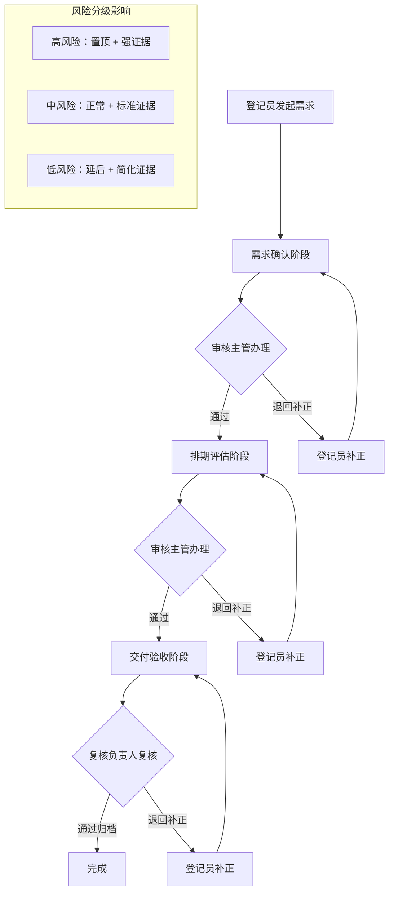

## 1. 产品概述

软件外包项目组风险分级处置需求交付单系统，用于管理外包需求从提报到归档的全生命周期流转，通过风险分级机制驱动队列优先级和处理动作差异，确保每一步推进或退回都有明确的意见记录和可追溯性。

### 1.1 产品目标
- 实现需求交付单三阶段流程：需求确认、排期评估、交付验收
- 通过高/中/低风险分级影响队列排序和必填证据要求
- 三种角色分工协作：登记员、审核主管、复核负责人
- 全流程操作留痕，支持追溯每一步的处理意见和结果

## 2. 核心功能

### 2.1 用户角色

| 角色 | 登录方式 | 核心权限 |
|------|----------|----------|
| 需求交付登记员 | 账号登录 | 发起需求交付单、补正退回的单据、查看本人发起的队列 |
| 需求交付审核主管 | 账号登录 | 办理需求确认和排期评估阶段、填写审核意见、推进或退回 |
| 软件外包项目组复核负责人 | 账号登录 | 复核归档交付验收阶段、查看全量数据、统计汇总 |

### 2.2 功能模块

1. **工作台首页**：风险分布统计、各阶段待办数量、快速入口
2. **需求交付单队列**：按阶段/风险/状态筛选、优先级排序、分页浏览
3. **需求交付单详情**：基本信息、风险分级、处理历史、操作按钮
4. **操作记录**：全流程操作日志、处理人、时间、意见、结果
5. **统计看板**：各阶段数量分布、风险分布、逾期统计

### 2.3 页面详情

| 页面名称 | 模块名称 | 功能描述 |
|----------|----------|----------|
| 工作台首页 | 统计卡片 | 待办总数、各阶段数量、风险分布饼图 |
| 工作台首页 | 快捷入口 | 发起新单、我的待办、全部单据 |
| 需求队列页 | 筛选区 | 按阶段、风险等级、状态、关键词筛选 |
| 需求队列页 | 列表区 | 优先级排序的需求卡片列表，展示标题、风险、状态、当前处理人 |
| 需求详情页 | 基本信息 | 需求标题、描述、风险等级、创建时间、版本号 |
| 需求详情页 | 流程进度 | 三阶段进度条，当前阶段高亮 |
| 需求详情页 | 处理历史 | 时间线形式展示每一步处理人、意见、结果、证据附件 |
| 需求详情页 | 操作区 | 根据当前角色和状态展示可执行操作（推进/退回/补正/归档） |
| 操作记录页 | 操作日志 | 全量操作记录表格，支持筛选和导出 |

## 3. 核心流程

### 3.1 主流程描述

需求交付登记员发起需求交付单 → 进入需求确认阶段 → 审核主管办理（确认通过/退回补正）→ 排期评估阶段 → 审核主管办理（评估通过/退回补正）→ 交付验收阶段 → 复核负责人复核归档 → 完成

### 3.2 风险分级影响

- **高风险**：队列置顶优先处理、需额外证据材料、每阶段必须填写详细意见
- **中风险**：正常优先级、需标准证据材料
- **低风险**：可延后处理、证据要求简化

### 3.3 异常场景

- **缺证据**：提交时证据不全，后端校验不通过，保留原状态并记录
- **逾期**：超出处理时限，标记逾期状态并提升优先级
- **退回补正**：审核不通过退回登记员补正，版本号+1
- **状态冲突**：并发操作时校验版本号，防止状态冲突

### 3.4 流程图

## 4. 用户界面设计

### 4.1 设计风格

- **设计调性**：专业严谨的企业级后台系统风格
- **主色调**：深蓝色 #1e3a5f 作为主色，体现专业可靠
- **辅助色**：高风险红色 #e53935、中风险橙色 #fb8c00、低风险绿色 #43a047
- **字体**：系统默认无衬线字体，标题加粗，正文常规
- **布局**：左侧导航 + 右侧内容区，卡片式信息组织
- **按钮风格**：圆角矩形，主按钮实心，次按钮描边

### 4.2 页面设计概览

| 页面名称 | 模块名称 | UI 元素 |
|----------|----------|---------|
| 工作台首页 | 统计卡片 | 渐变背景卡片、数字大字、趋势小箭头 |
| 需求队列页 | 筛选区 | 下拉选择器、搜索框、标签切换 |
| 需求队列页 | 列表卡片 | 风险色条左侧标识、标题、状态标签、时间 |
| 需求详情页 | 流程进度 | 三节点时间线、当前节点高亮脉冲动画 |
| 需求详情页 | 处理历史 | 竖向时间线、头像、意见气泡、证据链接 |
| 需求详情页 | 操作区 | 操作按钮组、意见输入框、证据上传 |

### 4.3 响应式

- 桌面端优先设计（1280px 起）
- 平板端自适应，导航收起为图标
- 移动端简化卡片布局，操作按钮底部悬浮

### 4.4 动效设计

- 页面进入：内容区从下往上淡入
- 状态变化：数字变化时计数动画
- 风险标签：高风险有微弱呼吸动画提醒
- 操作按钮：悬停轻微上浮，点击涟漪效果
