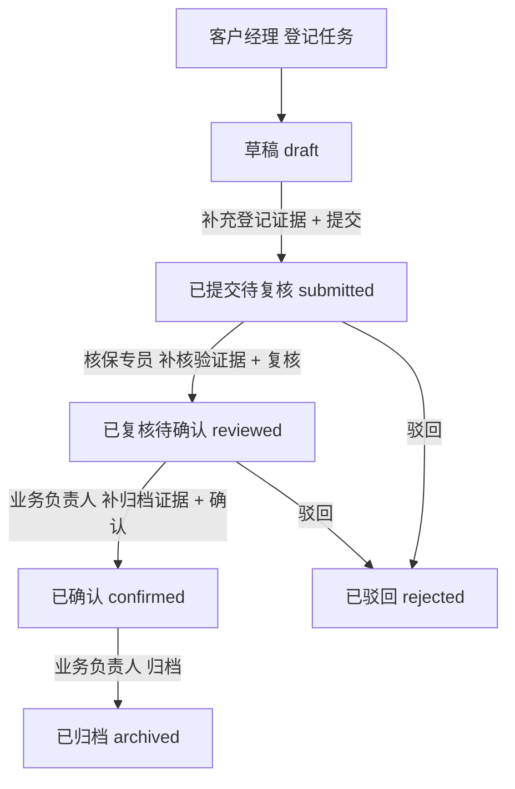
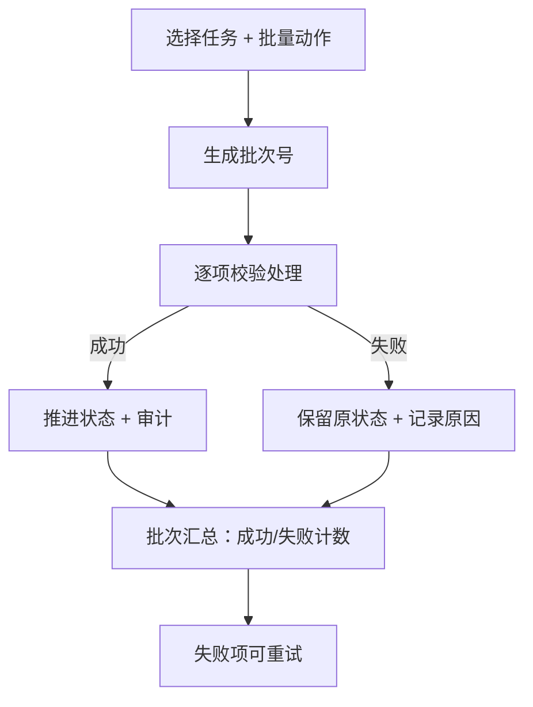

# 续保任务批量变更复核系统 — 产品需求文档（PRD）

## 1. 产品概述

续保任务批量变更复核系统，是面向保险续保业务的多角色流转审批控制台。核心解决：续保任务从「客户经理登记提交 → 核保专员过程核验 → 业务负责人复核归档」的全链路可审计流转，支持批量变更、部分成功、失败重试与批量审计，并对越权角色、旧版本、缺证据、错状态等异常在后端严格拦截并返回具体原因。

- 目标用户：保险机构续保业务的客户经理、核保专员、业务负责人
- 核心价值：把多岗位流转与批量变更的关键证据固化下来，做到「后一岗位不能替前一岗位补流程」，且任意环节失败都留痕可重试

## 2. 核心功能

### 2.1 用户角色

| 角色 | 登记方式 | 核心权限 |
|------|---------------------|------------------|
| 客户经理 (customer_manager) | 演示账号登录 | 登记续保任务、补登记证据、批量提交 |
| 核保专员 (underwriting_specialist) | 演示账号登录 | 过程核验、批量复核、驳回 |
| 业务负责人 (business_owner) | 演示账号登录 | 复核归档、批量确认、归档 |

> 岗位流转线严格分岗：后一岗位不能替前一岗位把流程补过去，由后端按角色 + 任务状态 + 证据强制校验。

### 2.2 功能模块

1. **续保任务队列页（首屏）**：以续保任务队列为主区，侧栏展示「续保任务登记 / 过程核验 / 复核归档」关键证据摘要，点击进入详情办理
2. **任务详情办理页**：证据链完整展示 + 按当前角色办理操作（提交 / 复核 / 确认 / 归档 / 驳回）
3. **批量变更工作台**：生成批次号、批次明细、部分成功、失败项留痕、失败重试、批量审计
4. **角色切换与筛选联动**：顶部切换角色上下文，筛选、详情办理与批量操作之间互相更新

### 2.3 页面详情

| 页面名称 | 模块名称 | 功能描述 |
|-----------|-------------|---------------------|
| 续保任务队列页 | 角色切换条 | 切换客户经理 / 核保专员 / 业务负责人上下文，刷新可办理动作 |
| 续保任务队列页 | 筛选区 | 按状态、批次、保单号、客户名筛选；筛选结果与队列联动 |
| 续保任务队列页 | 任务队列主区 | 列表展示续保任务，支持多选；显示任务号、保单号、状态、版本、当前岗位 |
| 续保任务队列页 | 关键证据侧栏 | 选中任务时展示登记 / 核验 / 归档三段证据摘要与是否齐备 |
| 续保任务队列页 | 批量操作条 | 对所选任务发起批量提交 / 复核 / 确认 / 归档，生成批次号 |
| 任务详情办理页 | 证据链 | 展示登记证据、核验证据、归档证据及其操作人与时间 |
| 任务详情办理页 | 办理操作区 | 按当前角色与任务状态显示可执行动作，提交时携带版本号 |
| 任务详情办理页 | 流转历史 | 展示该任务的流转与审计轨迹 |
| 批量变更工作台 | 批次列表 | 展示历史批次号、动作、成功/失败计数、状态 |
| 批量变更工作台 | 批次明细 | 展示批次内每一项的成功/失败与失败原因，支持失败重试 |
| 批量变更工作台 | 批量审计 | 展示批次对应的审计日志（操作人、角色、前后状态、详情） |

## 3. 核心流程

### 3.1 流转线说明

1. 客户经理登记续保任务，补充「续保任务登记证据」，提交后任务进入「已提交待复核」
2. 核保专员在队列中复核，补充「过程核验证据」，复核后任务进入「已复核待确认」
3. 业务负责人确认，补充「复核归档证据」，确认后任务进入「已确认」，可归档

### 3.2 流程图

### 3.3 批量变更流程

1. 选中多个任务，选择批量动作（提交 / 复核 / 确认 / 归档）
2. 后端生成批次号（如 `BN-20260618-0001`），逐项处理
3. 每项独立判定：成功则推进状态；失败则保留原状态并记录 `error_reason`（错角色 / 旧版本 / 缺证据 / 错状态）
4. 失败项不被吞掉，留在批次明细中，可对失败项发起重试

## 4. 用户界面设计

### 4.1 设计风格

- 主色：深墨青（deep teal）作为品牌主色，传达金融信任感；辅以暖纸白底
- 强调与状态色：草稿=石板灰、待办=琥珀、成功=翠绿、失败=砖红、已确认=深青
- 字体：标题用 Fraunces（衬线，编辑/文档气质），正文用 IBM Plex Sans，数据/批次号/审计用 IBM Plex Mono
- 布局：桌面优先，左主队列 + 右证据侧栏；顶部角色切换条与筛选条
- 按钮：轻微圆角、清晰层级（主操作填充、次操作描边、危险操作砖红描边）
- 数据质感：批次号、任务号、保单号用等宽字体并加可复制标签

### 4.2 页面设计概览

| 页面名称 | 模块名称 | UI 元素 |
|-----------|-------------|-------------|
| 续保任务队列页 | 角色切换条 | 三个角色徽标，当前角色高亮，切换时刷新可办理动作 |
| 续保任务队列页 | 筛选区 | 状态多选、批次搜索、关键字输入；筛选与列表联动 |
| 续保任务队列页 | 任务队列主区 | 表格行、状态胶囊、版本徽标、多选复选框、行点击进详情 |
| 续保任务队列页 | 关键证据侧栏 | 三段证据卡片（登记/核验/归档）+ 齐备指示灯 |
| 续保任务队列页 | 批量操作条 | 浮动操作条，显示已选数量与批量动作按钮 |
| 任务详情办理页 | 证据链 | 时间线展示三段证据与操作人时间 |
| 任务详情办理页 | 办理操作区 | 角色受限的动作按钮，表单含证据文本与版本号 |
| 任务详情办理页 | 流转历史 | 审计日志列表 |
| 批量变更工作台 | 批次列表 | 批次卡片，成功/失败计数条 |
| 批量变更工作台 | 批次明细 | 明细表，失败行砖红高亮 + 重试按钮 |
| 批量变更工作台 | 批量审计 | 审计日志表 |

### 4.3 响应式

桌面优先设计，宽屏（≥1280px）下左侧队列 + 右侧证据侧栏并排；中等宽度折叠为单列；触控下增大行高与按钮命中区域。

### 4.4 3D 场景

不适用（本系统为业务审批控制台，无 3D 场景需求）。
