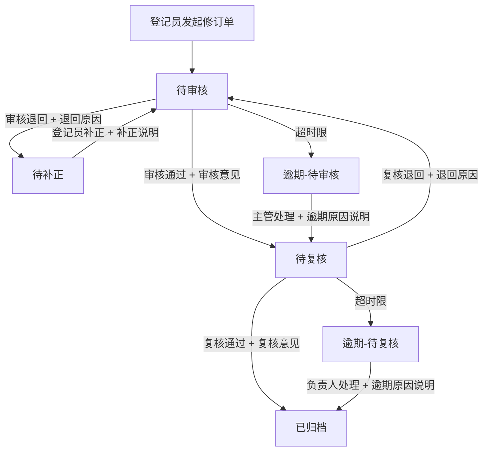

## 1. 产品概述

客服呼叫中心到期预警处理知识修订单系统，用于管理知识库内容到期预警后的修订全流程——从登记员发起修订单、审核主管审核、到复核负责人复核归档。系统解决「谁来处理」「为什么推进/退回」「逾期如何处理」三大核心问题，确保每一份修订单的推进都有据可查、越权和异常操作被拦截、审计记录完整可倒查。

- 目标用户：客服呼叫中心的知识修登记员、知识修审核主管、复核负责人
- 核心价值：到期预警知识修订流程规范化，杜绝静默推进，保障单据可审计可倒查

## 2. 核心功能

### 2.1 用户角色

| 角色 | 队列 | 核心权限 |
|------|------|----------|
| 知识修登记员 | 待登记 / 待补正 | 发起知识修订单、补正退回的单据、查看本人发起的单据 |
| 知识修审核主管 | 待审核 | 审核通过（推进到复核）、审核退回（退回登记员补正）、查看待审核队列 |
| 客服呼叫中心复核负责人 | 待复核 | 复核通过并归档、复核退回（退回审核主管）、查看待复核队列 |

### 2.2 功能模块

1. **知识修订单列表页**：按角色队列筛选、状态筛选、逾期标记、批量操作、统计概览
2. **知识修订单详情页**：单据信息、材料附件、处理意见、操作记录时间线、推进/退回操作
3. **知识修订单发起/补正页**：表单录入、材料上传、知识库反馈关联、时限设定
4. **统计与审计页**：各状态统计、逾期统计、操作审计日志查询

### 2.3 页面详情

| 页面名称 | 模块名称 | 功能描述 |
|----------|----------|----------|
| 知识修订单列表 | 筛选区 | 按角色自动筛选队列、手动切换状态/逾期筛选、关键字搜索 |
| 知识修订单列表 | 统计概览 | 各状态数量统计、逾期数量高亮、当前角色待办数量 |
| 知识修订单列表 | 列表区 | 显示修订单号、标题、状态、发起人、当前处理人、时限、逾期标记、操作按钮 |
| 知识修订单列表 | 批量操作 | 批量审核通过、批量退回（需填写退回原因） |
| 知识修订单详情 | 单据信息 | 修订单号、标题、关联知识库条目、到期预警信息、当前状态、时限 |
| 知识修订单详情 | 材料区 | 材料列表、材料是否齐全标记（影响推进） |
| 知识修订单详情 | 知识库反馈 | 关联的知识库反馈内容、反馈是否已处理标记 |
| 知识修订单详情 | 内容修订 | 修订前后对比、修订说明 |
| 知识修订单详情 | 处理意见 | 当前处理人填写的推进/退回意见，必填 |
| 知识修订单详情 | 逾期信息 | 逾期天数、逾期原因、后续处理动作（仅逾期单据显示） |
| 知识修订单详情 | 操作区 | 推进/退回按钮、补正提交按钮（根据角色和状态动态显示） |
| 知识修订单详情 | 操作记录 | 时间线展示所有提交、驳回、补正、失败记录及原因 |
| 知识修订单发起 | 表单区 | 标题、关联知识库条目、修订内容、材料上传、时限天数、备注 |
| 知识修订单补正 | 表单区 | 加载原单据信息、补充材料、修改内容、补正说明 |
| 统计与审计 | 统计区 | 各状态单据数量、逾期数量、各角色处理数量 |
| 统计与审计 | 审计日志 | 按修订单号/操作人/操作类型/时间范围查询，显示完整操作记录 |

## 3. 核心流程

知识修订单从发起到归档的三阶段流转，每个阶段必须说明推进/退回原因，材料不齐全或知识库反馈未处理时不可推进，逾期的单据不能自动推进必须人工处理并记录逾期原因。

**推进规则**：
- 材料必须齐全，否则拒绝推进并提示缺失材料
- 知识库反馈必须已处理，否则拒绝推进
- 处理意见必须填写，否则拒绝推进
- 当前操作人必须是该队列的处理人，否则拒绝（越权）
- 操作必须符合状态流转顺序，否则拒绝
- 并发提交时使用乐观锁，版本不一致则拒绝

**逾期规则**：
- 超过时限不自动推进，状态标记为逾期
- 逾期单据在列表中标红显示逾期天数
- 逾期单据详情中显示逾期原因字段（必填）和后续处理动作
- 逾期处理时必须填写逾期原因说明

## 4. 用户界面设计

### 4.1 设计风格

- 主色调：深蓝色 (#1e3a5f) + 橙色警示 (#e67e22)
- 辅助色：浅灰背景 (#f5f7fa)、白色卡片、红色逾期标记 (#e74c3c)
- 按钮：圆角8px，主操作深蓝色、危险操作红色、常规操作灰色
- 字体：系统字体栈，标题16px加粗、正文14px、辅助12px
- 布局：顶部导航栏 + 左侧角色切换 + 主内容区卡片式布局
- 图标：使用 lucide 图标库

### 4.2 页面设计概览

| 页面名称 | 模块名称 | UI元素 |
|----------|----------|--------|
| 知识修订单列表 | 筛选区 | 角色Tab切换、状态下拉、逾期开关、搜索框 |
| 知识修订单列表 | 统计概览 | 四个统计卡片(待办/审核中/复核中/逾期)、数字高亮 |
| 知识修订单列表 | 列表区 | 表格、状态徽章、逾期红色标记、操作按钮列 |
| 知识修订单列表 | 批量操作 | 底部浮动操作栏、勾选计数、批量操作按钮 |
| 知识修订单详情 | 信息区 | 卡片布局、字段标签+值、状态徽章 |
| 知识修订单详情 | 材料区 | 文件列表、齐全/缺失状态图标 |
| 知识修订单详情 | 逾期区 | 红色警告卡片、逾期天数、原因输入、处理动作选择 |
| 知识修订单详情 | 操作区 | 推进(蓝)/退回(红)按钮、意见输入框、确认弹窗 |
| 知识修订单详情 | 操作记录 | 左侧时间线、操作类型图标、操作人、时间、原因 |
| 发起/补正页 | 表单区 | 表单卡片、必填标记、文件上传区、时限选择器 |

### 4.3 响应式

桌面优先设计，最小宽度1024px，表格横向滚动，表单单列布局。

### 4.4 交互设计

- 角色切换后自动刷新列表到对应队列
- 推进/退回操作前弹出确认弹窗，要求填写意见
- 逾期单据进入详情时自动弹出逾期处理提示
- 批量操作需二次确认
- 表单提交时校验必填项和材料齐全性
- 操作失败时显示明确错误原因（不静默失败）
