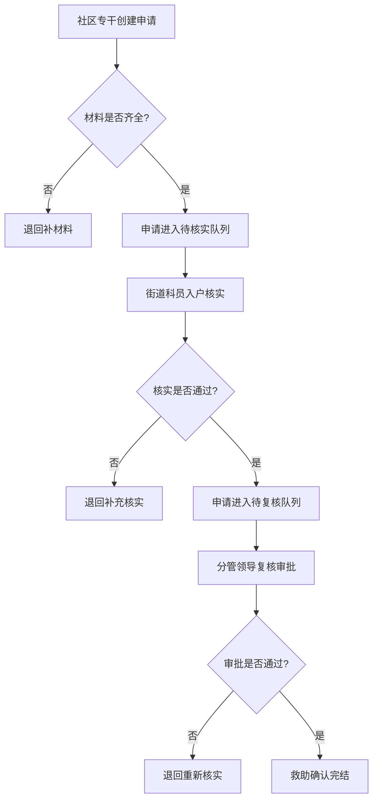
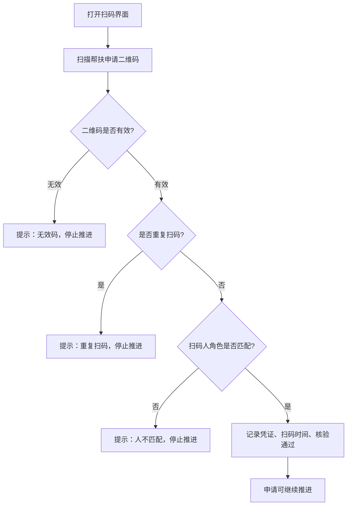
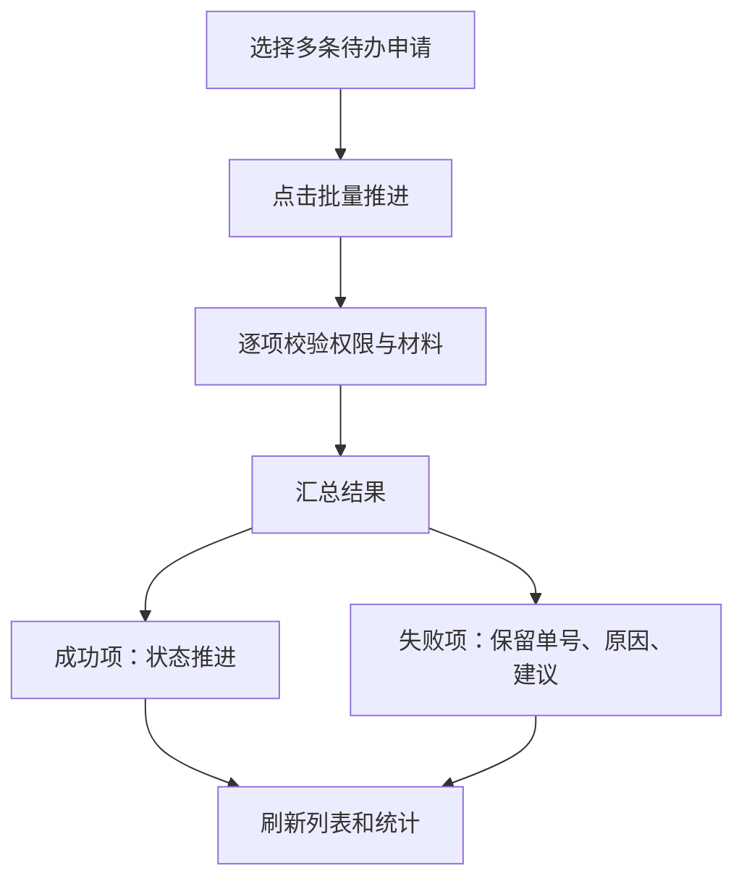

## 1. 产品概述

街道办事处-现场扫码核验帮扶申请系统，用于基层街道的困难帮扶申请全流程数字化管理。系统覆盖「社区专干建单 → 街道科员推进 → 分管领导复核」三级审批链路，支持现场扫码核验、批量处理和完整审计追溯，确保帮扶申请不越权、不跳步、不丢证。

- 目标用户：街道办事处工作人员（社区专干、街道科员、分管领导）
- 核心价值：消除纸质流转、杜绝越权审批、实时掌握队列进度、扫码核验留证

## 2. 核心功能

### 2.1 用户角色

| 角色 | 建号方式 | 核心权限 |
|------|----------|----------|
| 社区专干 | 系统预设 | 创建帮扶申请、上传申请材料、查看本人建单队列 |
| 街道科员 | 系统预设 | 入户核实推进、上传核实材料、扫码核验、查看待核实队列 |
| 分管领导 | 系统预设 | 救助确认复核、审批意见签署、查看待复核队列、统计总览 |

### 2.2 功能模块

1. **登录与角色切换页**：模拟登录、一键切换岗位视角
2. **工作台首页**：当前角色待办队列概览、统计数据、快捷入口
3. **帮扶申请队列页**：按角色筛选的动态队列列表，非静态表格
4. **帮扶申请详情页**：三阶段（困难帮扶 / 入户核实 / 救助确认）材料、时限、处理意见完整展示与操作
5. **扫码核验页**：摄像头扫码、核验凭证记录、扫码时间、结果判定
6. **批量处理页**：批量推进申请、逐项结果反馈（含单号、失败原因、下一步建议）

### 2.3 页面详情

| 页面名称 | 模块名称 | 功能描述 |
|----------|----------|----------|
| 登录与角色切换 | 角色选择 | 下拉选择社区专干/街道科员/分管领导登录，切换后刷新队列和权限 |
| 工作台首页 | 统计卡片 | 待办数、已办数、逾期数、今日扫码数实时统计 |
| 工作台首页 | 待办队列预览 | 各队列前5条待办，点击跳转详情 |
| 帮扶申请队列 | 队列筛选 | Tab切换：待建单/待核实/待复核/已完结，按角色自动聚焦默认Tab |
| 帮扶申请队列 | 队列列表 | 动态卡片式列表，显示单号、申请人、类型、时限倒计时、当前状态 |
| 帮扶申请详情 | 困难帮扶阶段 | 申请表、困难证明材料上传、社区专干填写申请意见 |
| 帮扶申请详情 | 入户核实阶段 | 街道科员填写核实记录、上传入户照片、处理意见 |
| 帮扶申请详情 | 救助确认阶段 | 分管领导签署审批意见、确认救助金额和方式 |
| 帮扶申请详情 | 时限监控 | 各阶段时限倒计时，超时预警标红 |
| 帮扶申请详情 | 审计轨迹 | 全流程操作日志，含操作人、时间、动作、结果 |
| 扫码核验 | 扫码界面 | 调用摄像头扫描帮扶申请二维码 |
| 扫码核验 | 核验结果 | 显示凭证号、扫码时间、核验结果（通过/无效码/重复扫码/人不匹配） |
| 扫码核验 | 异常拦截 | 无效码、重复扫码、扫码人不匹配时停止推进，显示原因 |
| 批量处理 | 批量选择 | 勾选多条申请批量推进 |
| 批量处理 | 逐项结果 | 每条申请显示：单号、成功/失败、失败原因、下一步建议 |

## 3. 核心流程

### 3.1 帮扶申请三级流转

社区专干在系统中创建帮扶申请，填写困难情况并上传证明材料；街道科员收到待核实队列中的申请后进行入户核实，记录核实情况并上传入户照片；分管领导对待复核申请进行最终审批，签署意见并确认救助方案。任一环节材料不全或越权操作均阻止推进。

### 3.2 扫码核验流程

### 3.3 批量处理流程

## 4. 用户界面设计

### 4.1 设计风格

- **主色调**：深蓝 #1a365d（政务感），辅助色翠绿 #38a169（通行/通过），警告色橙红 #e53e3e
- **按钮风格**：圆角6px，主按钮实色填充，次按钮描边
- **字体**：思源黑体 / Noto Sans SC，标题16-18px，正文14px，辅助12px
- **布局风格**：左侧导航 + 右侧内容区，卡片式布局
- **图标**：Lucide Icons（线性风格）

### 4.2 页面设计概览

| 页面名称 | 模块名称 | UI要素 |
|----------|----------|--------|
| 登录与角色切换 | 角色卡片 | 三张角色卡片，悬停放大，点击登录，深蓝底白字 |
| 工作台首页 | 统计卡片 | 四宫格卡片，数字大字号，图标+标签，hover阴影 |
| 工作台首页 | 待办预览 | 紧凑卡片列表，时限标签（绿色正常/橙色临期/红色超期） |
| 帮扶申请队列 | 队列Tab | 顶部Tab栏，激活Tab下划线，列表区域可滚动 |
| 帮扶申请详情 | 三阶段时间轴 | 竖向时间轴，已完成节点绿色、当前节点蓝色、待处理灰色 |
| 扫码核验 | 扫码框 | 居中方框扫码框，实时摄像头画面，结果即时弹出 |
| 批量处理 | 结果表格 | 表格式逐项结果，成功行绿底、失败行红底，展开查看建议 |

### 4.3 响应式设计

桌面优先（1440px基准），平板适配（1024px），暂不做手机端适配。

## 5. 安全与守卫规则

| 场景 | 守卫行为 |
|------|----------|
| 越权操作（如专干直接复核） | 返回403，前端提示「无权操作」，申请不推进 |
| 顺序错误（如跳过核实直接复核） | 返回422，前端提示「流程顺序错误」，申请不推进 |
| 材料缺失（如未上传困难证明） | 返回422，前端提示「必要材料缺失」，申请不推进 |
| 并发提交（两个页面同时操作同一申请） | 乐观锁校验，后提交返回409，前端提示「数据已变更请刷新」 |
| 无效码扫码 | 返回400，停留在当前队列 |
| 重复扫码 | 返回400，停留在当前队列 |
| 扫码人角色不匹配 | 返回403，停留在当前队列 |
