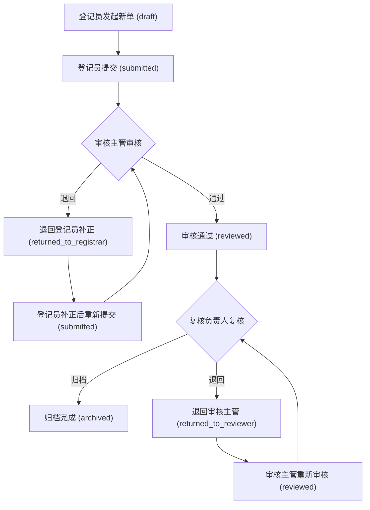

# 菜品上新流程管理系统 — 产品需求文档（PRD）

## 1. 产品概述

餐饮连锁企业菜品上新全流程管理系统，覆盖"登记员发起/补正 → 审核主管办理 → 总部复核负责人复核归档"三岗流水线。  
核心价值：**补录校验必须影响后续动作而非仅做标签**，后岗不能替前岗补流程，缺证据/错角色/旧版本/错状态全部在前后端拦截并返回具体原因。

## 2. 核心功能

### 2.1 用户角色

| 角色 | 登录账号 | 核心权限 |
|------|----------|----------|
| 菜品上新登记员 | `registrar` | 发起新单、补正被退回的单据 |
| 菜品上新审核主管 | `reviewer` | 审核单据、退回补正、通过送复核 |
| 餐饮连锁总部复核负责人 | `archiver` | 复核归档、退回审核 |

### 2.2 功能模块

1. **菜品上新单队列主屏**：左侧单据列表 + 右侧关键证据面板
2. **单据详情办理页**：进入后完成当前岗位操作
3. **角色切换**：顶部切换当前登录角色，切换后队列/筛选/操作即时刷新
4. **筛选与搜索**：按状态、日期、关键词筛选
5. **批量操作**：多选后批量通过/退回
6. **后端强校验**：所有提交经后端校验，非法请求返回具体错误

### 2.3 页面详情

| 页面名称 | 模块名称 | 功能描述 |
|----------|----------|----------|
| 队列主屏 | 单据列表 | 按角色显示待办队列，支持状态筛选、关键词搜索、批量选择 |
| 队列主屏 | 证据面板 | 右侧展示选中单据的登记证据、核验记录、归档证据 |
| 队列主屏 | 角色切换 | 顶部角色选择器，切换后队列和操作按钮同步更新 |
| 详情办理页 | 表单区 | 显示单据完整信息，当前角色可执行操作（提交/审核/退回/归档） |
| 详情办理页 | 流程轨迹 | 展示该单据全流程操作历史和时间线 |
| 详情办理页 | 证据上传 | 登记员补正时上传缺失证据，审核/复核查看证据 |

## 3. 核心流程

### 3.1 单据状态流转

单据状态：`draft` → `submitted` → `reviewed` → `archived`，任意环节可退回至前一状态。

```
登记员新建(draft) → 登记员提交(submitted) → 审核主管审核通过(reviewed) → 复核负责人归档(archived)
                         ↑ 退回                    ↑ 退回
                    登记员补正(submitted)      审核主管重新审核(reviewed)
```

### 3.2 Mermaid 流程图



### 3.3 校验规则（前后端一致执行）

| 校验项 | 规则 | 拦截方式 |
|--------|------|----------|
| 角色校验 | 当前操作者角色必须与操作要求的角色匹配 | 后端返回 `WRONG_ROLE` |
| 状态校验 | 单据状态必须处于允许该操作的状态 | 后端返回 `WRONG_STATUS` |
| 版本校验 | 提交时携带版本号，必须与数据库当前版本一致 | 后端返回 `VERSION_CONFLICT` |
| 证据校验 | 提交/审核/归档时必要证据不可缺失 | 后端返回 `MISSING_EVIDENCE` |
| 重复补录 | 同一单据同一环节不可重复提交相同内容 | 后端返回 `DUPLICATE_SUBMISSION` |
| 覆盖保护 | 已被下一环节处理过的单据不可再操作 | 后端返回 `ALREADY_PROCESSED` |

## 4. 用户界面设计

### 4.1 设计风格

- 主色调：深靛蓝 `#1e3a5f` + 琥珀强调色 `#d97706`
- 按钮风格：圆角 6px，操作按钮有明确状态颜色（通过=绿、退回=橙、归档=靛蓝）
- 字体：正文用 Noto Sans SC，标题用 Source Han Sans CN Bold
- 布局：左侧 60% 单据队列 + 右侧 40% 证据面板，详情页全屏模态
- 图标：Lucide React 图标库

### 4.2 页面设计概述

| 页面名称 | 模块名称 | UI 元素 |
|----------|----------|---------|
| 队列主屏 | 单据列表 | 卡片列表、状态标签(彩色药丸)、多选复选框、筛选下拉 |
| 队列主屏 | 证据面板 | 分区折叠面板(登记证据/核验记录/归档证据)、证据缩略图 |
| 队列主屏 | 角色切换 | 顶部角色下拉、当前角色徽章 |
| 详情办理页 | 表单区 | 分组表单、操作按钮栏、版本号显示 |
| 详情办理页 | 流程轨迹 | 垂直时间线、每步操作人和时间 |
| 详情办理页 | 证据上传 | 拖拽上传区、已上传文件列表 |

### 4.3 响应式

- 桌面优先设计，1024px 以下证据面板折叠为底部抽屉
- 触控优化：按钮最小 44px 点击区域

## 5. 演示数据样例（暴露问题）

| 单据编号 | 设计目的 | 特征 |
|----------|----------|------|
| CPXJ-001 | 正常全流程 | 各环节证据齐全，可顺利走完 |
| CPXJ-002 | 重复补录 | 登记员对同一单据尝试重复提交 |
| CPXJ-003 | 缺证据 | 登记员提交时缺少必要证据 |
| CPXJ-004 | 覆盖结果 | 单据已被审核通过，登记员再尝试修改 |
| CPXJ-005 | 错角色操作 | 审核主管尝试替登记员发起单据 |
| CPXJ-006 | 旧版本提交 | 使用过期版本号提交 |
| CPXJ-007 | 错状态操作 | 对已归档单据尝试审核 |
