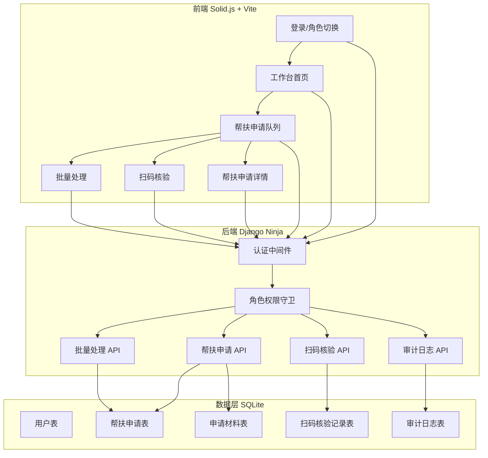
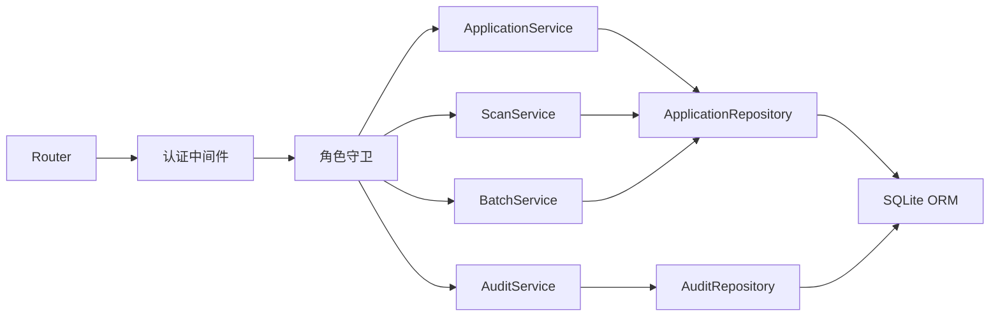
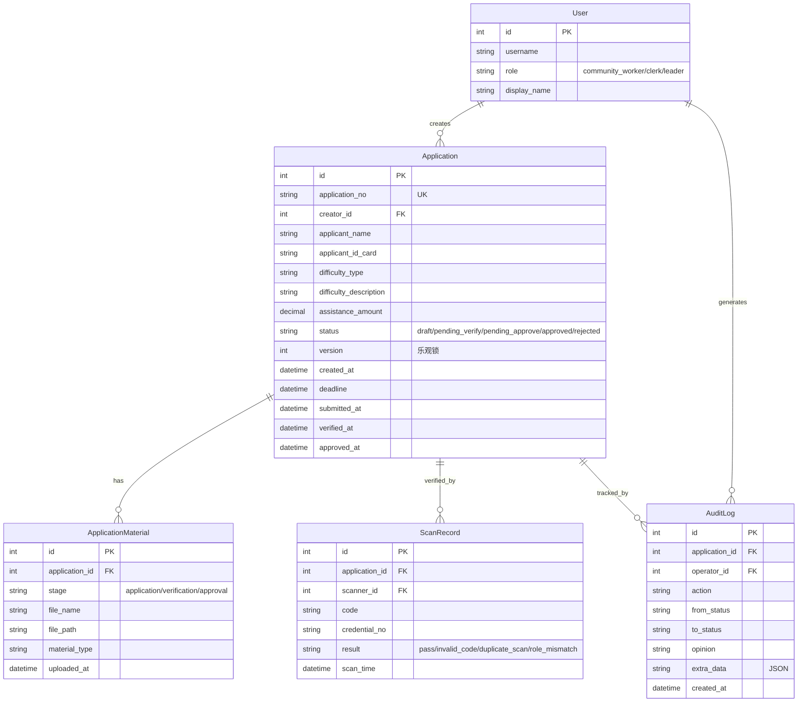

## 1. 架构设计



## 2. 技术说明

- **前端**：Solid.js + Vite，端口 3008（通过环境变量 VITE_PORT 配置）
- **后端**：Python 3 + Django + Django Ninja，端口 8008（通过环境变量 DJANGO_PORT 配置）
- **数据库**：SQLite（本地演示优先）
- **CORS**：前端地址从环境变量读取，不写死
- **状态管理**：Solid.js 原生 Signal / Store
- **HTTP 客户端**：前端使用原生 fetch 封装

## 3. 路由定义

| 路由 | 用途 |
|------|------|
| / | 登录与角色选择页 |
| /dashboard | 工作台首页 |
| /queue | 帮扶申请队列页 |
| /application/:id | 帮扶申请详情页 |
| /scan | 扫码核验页 |
| /batch | 批量处理页 |

## 4. API 定义

### 4.1 认证相关

```typescript
POST /api/auth/login
  Request:  { username: string, role: "community_worker" | "clerk" | "leader" }
  Response: { token: string, user: { id, username, role, display_name } }

GET /api/auth/me
  Response: { id, username, role, display_name }
```

### 4.2 帮扶申请

```typescript
GET /api/applications/
  Query: { status?: string, role?: string, page?: number, page_size?: number }
  Response: { items: Application[], total: number, page: number }

POST /api/applications/
  Request: {
    applicant_name: string,
    applicant_id_card: string,
    difficulty_type: "medical" | "disaster" | "disability" | "low_income" | "other",
    difficulty_description: string,
    assistance_amount: number,
    materials: File[]
  }
  Response: Application

GET /api/applications/:id
  Response: ApplicationDetail

POST /api/applications/:id/advance
  Request: {
    action: "submit" | "verify" | "approve" | "reject",
    opinion: string,
    materials?: File[]
  }
  Response: { success: boolean, application: Application, error?: string }
```

### 4.3 扫码核验

```typescript
POST /api/scan/verify
  Request: { code: string }
  Response: {
    valid: boolean,
    application_id?: string,
    credential_no?: string,
    scan_time: string,
    result: "pass" | "invalid_code" | "duplicate_scan" | "role_mismatch",
    message: string
  }
```

### 4.4 批量处理

```typescript
POST /api/batch/advance
  Request: {
    application_ids: string[],
    action: "verify" | "approve",
    opinion: string
  }
  Response: {
    results: BatchResultItem[]
  }

type BatchResultItem = {
  application_id: string,
  success: boolean,
  error?: string,
  suggestion?: string
}
```

### 4.5 审计日志

```typescript
GET /api/audit/logs/
  Query: { application_id?: string, action?: string, page?: number }
  Response: { items: AuditLog[], total: number }
```

### 4.6 统计

```typescript
GET /api/stats/summary
  Query: { role?: string }
  Response: {
    pending_count: number,
    done_count: number,
    overdue_count: number,
    today_scan_count: number
  }
```

## 5. 后端架构图



## 6. 数据模型

### 6.1 数据模型定义



### 6.2 数据定义语言

```sql
CREATE TABLE auth_user (
    id INTEGER PRIMARY KEY AUTOINCREMENT,
    username VARCHAR(50) NOT NULL UNIQUE,
    password VARCHAR(128) NOT NULL,
    role VARCHAR(20) NOT NULL CHECK (role IN ('community_worker', 'clerk', 'leader')),
    display_name VARCHAR(50) NOT NULL,
    is_active BOOLEAN DEFAULT 1,
    created_at DATETIME DEFAULT CURRENT_TIMESTAMP
);

CREATE TABLE applications_application (
    id INTEGER PRIMARY KEY AUTOINCREMENT,
    application_no VARCHAR(20) NOT NULL UNIQUE,
    creator_id INTEGER NOT NULL REFERENCES auth_user(id),
    applicant_name VARCHAR(50) NOT NULL,
    applicant_id_card VARCHAR(18) NOT NULL,
    difficulty_type VARCHAR(20) NOT NULL,
    difficulty_description TEXT NOT NULL DEFAULT '',
    assistance_amount DECIMAL(10,2) NOT NULL DEFAULT 0,
    status VARCHAR(20) NOT NULL DEFAULT 'draft',
    version INTEGER NOT NULL DEFAULT 1,
    created_at DATETIME DEFAULT CURRENT_TIMESTAMP,
    deadline DATETIME,
    submitted_at DATETIME,
    verified_at DATETIME,
    approved_at DATETIME,
    opinion_text TEXT DEFAULT ''
);

CREATE TABLE applications_applicationmaterial (
    id INTEGER PRIMARY KEY AUTOINCREMENT,
    application_id INTEGER NOT NULL REFERENCES applications_application(id) ON DELETE CASCADE,
    stage VARCHAR(20) NOT NULL,
    file_name VARCHAR(200) NOT NULL,
    file_path VARCHAR(500) NOT NULL,
    material_type VARCHAR(50) NOT NULL DEFAULT 'other',
    uploaded_at DATETIME DEFAULT CURRENT_TIMESTAMP
);

CREATE TABLE applications_scanrecord (
    id INTEGER PRIMARY KEY AUTOINCREMENT,
    application_id INTEGER NOT NULL REFERENCES applications_application(id),
    scanner_id INTEGER NOT NULL REFERENCES auth_user(id),
    code VARCHAR(100) NOT NULL,
    credential_no VARCHAR(50) NOT NULL,
    result VARCHAR(20) NOT NULL,
    scan_time DATETIME DEFAULT CURRENT_TIMESTAMP
);

CREATE TABLE applications_auditlog (
    id INTEGER PRIMARY KEY AUTOINCREMENT,
    application_id INTEGER NOT NULL REFERENCES applications_application(id),
    operator_id INTEGER NOT NULL REFERENCES auth_user(id),
    action VARCHAR(50) NOT NULL,
    from_status VARCHAR(20) NOT NULL DEFAULT '',
    to_status VARCHAR(20) NOT NULL DEFAULT '',
    opinion TEXT DEFAULT '',
    extra_data TEXT DEFAULT '{}',
    created_at DATETIME DEFAULT CURRENT_TIMESTAMP
);

CREATE INDEX idx_application_status ON applications_application(status);
CREATE INDEX idx_application_creator ON applications_application(creator_id);
CREATE INDEX idx_scanrecord_code ON applications_scanrecord(code);
CREATE INDEX idx_auditlog_application ON applications_auditlog(application_id);
CREATE INDEX idx_auditlog_operator ON applications_auditlog(operator_id);
```

## 7. 状态机定义

```
draft → pending_verify → pending_approve → approved
  ↑          ↓                ↓             ↑
  └── reject ←──────── reject ←───────────┘

状态权限映射：
- draft: 仅社区专干可操作（提交/编辑）
- pending_verify: 仅街道科员可操作（核实通过/退回）
- pending_approve: 仅分管领导可操作（审批通过/退回）
- approved/rejected: 终态，不可操作
```

## 8. 项目目录结构

```
trae-code-8/
├── frontend/
│   ├── src/
│   │   ├── components/     # 通用组件
│   │   ├── pages/          # 页面组件
│   │   ├── stores/         # Solid.js Signal/Store
│   │   ├── utils/          # 工具函数、fetch封装
│   │   ├── App.tsx
│   │   └── index.tsx
│   ├── index.html
│   ├── vite.config.ts
│   ├── package.json
│   └── tsconfig.json
├── backend/
│   ├── manage.py
│   ├── config/             # Django项目配置
│   │   ├── settings.py
│   │   ├── urls.py
│   │   └── wsgi.py
│   ├── apps/
│   │   ├── auth/           # 认证模块
│   │   └── applications/   # 帮扶申请模块
│   ├── requirements.txt
│   └── .env                # 环境变量
└── .trae/documents/
```
