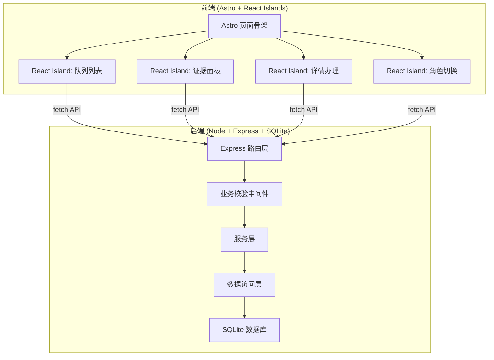
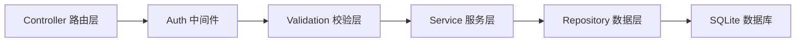
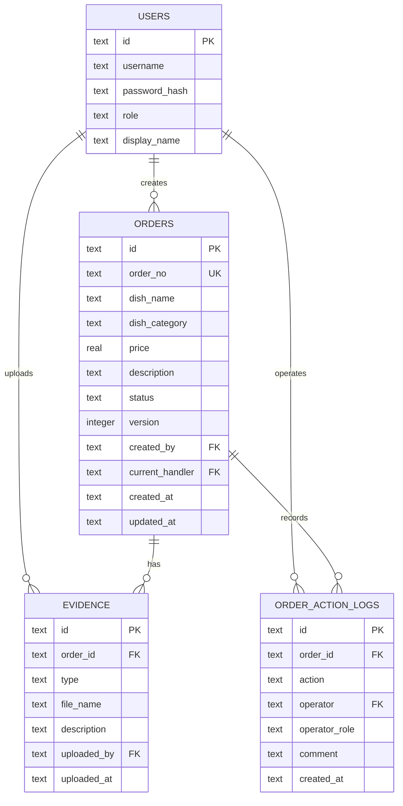

# 菜品上新流程管理系统 — 技术架构文档

## 1. 架构设计



## 2. 技术说明

- **前端**: Astro@5 + React@18 + TailwindCSS@3，React Islands 交互组件
- **构建工具**: Astro 内置 Vite
- **后端**: Node.js + Express@4 + TypeScript (ESM)
- **数据库**: SQLite3 (better-sqlite3)
- **状态管理**: Zustand (React Island 内部)
- **端口**: 前端 3002，后端 8002
- **CORS**: 后端放行 `http://localhost:3002`

## 3. 路由定义

| 前端路由 | 用途 |
|----------|------|
| `/` | 队列主屏（含证据面板） |
| `/order/:id` | 单据详情办理页 |

## 4. API 定义

### 4.1 认证与角色

| 方法 | 路径 | 用途 |
|------|------|------|
| POST | `/api/auth/login` | 登录，返回角色和 token |
| GET | `/api/auth/me` | 获取当前用户信息 |

### 4.2 单据操作

| 方法 | 路径 | 用途 |
|------|------|------|
| GET | `/api/orders` | 获取单据列表（支持筛选参数） |
| GET | `/api/orders/:id` | 获取单据详情 |
| POST | `/api/orders` | 登记员发起新单 |
| PUT | `/api/orders/:id/submit` | 登记员提交单据 |
| PUT | `/api/orders/:id/review` | 审核主管审核通过 |
| PUT | `/api/orders/:id/review-return` | 审核主管退回补正 |
| PUT | `/api/orders/:id/archive` | 复核负责人归档 |
| PUT | `/api/orders/:id/archive-return` | 复核负责人退回审核 |
| PUT | `/api/orders/:id/amend` | 登记员补正重新提交 |
| POST | `/api/orders/batch` | 批量操作（通过/退回） |

### 4.3 证据

| 方法 | 路径 | 用途 |
|------|------|------|
| GET | `/api/orders/:id/evidence` | 获取单据证据列表 |
| POST | `/api/orders/:id/evidence` | 上传证据 |

### 4.4 请求/响应类型

```typescript
interface Order {
  id: string;
  orderNo: string;
  dishName: string;
  dishCategory: string;
  price: number;
  description: string;
  status: OrderStatus;
  version: number;
  createdBy: string;
  currentHandler: string;
  createdAt: string;
  updatedAt: string;
}

type OrderStatus =
  | "draft"
  | "submitted"
  | "returned_to_registrar"
  | "reviewed"
  | "returned_to_reviewer"
  | "archived";

interface Evidence {
  id: string;
  orderId: string;
  type: "registration" | "verification" | "archive";
  fileName: string;
  description: string;
  uploadedBy: string;
  uploadedAt: string;
}

interface OrderActionLog {
  id: string;
  orderId: string;
  action: string;
  operator: string;
  operatorRole: string;
  comment: string;
  createdAt: string;
}

interface ApiResponse<T> {
  success: boolean;
  data?: T;
  error?: {
    code: string;
    message: string;
  };
}
```

### 4.5 错误码

| 错误码 | 含义 | HTTP 状态 |
|--------|------|-----------|
| `WRONG_ROLE` | 当前角色无权执行此操作 | 403 |
| `WRONG_STATUS` | 单据状态不允许此操作 | 409 |
| `VERSION_CONFLICT` | 版本号冲突，数据已被他人修改 | 409 |
| `MISSING_EVIDENCE` | 缺少必要证据 | 422 |
| `DUPLICATE_SUBMISSION` | 重复提交 | 409 |
| `ALREADY_PROCESSED` | 单据已被处理 | 409 |
| `NOT_FOUND` | 单据不存在 | 404 |
| `UNAUTHORIZED` | 未登录 | 401 |

## 5. 服务端架构图



## 6. 数据模型

### 6.1 ER 图



### 6.2 DDL

```sql
CREATE TABLE users (
  id TEXT PRIMARY KEY,
  username TEXT UNIQUE NOT NULL,
  password_hash TEXT NOT NULL,
  role TEXT NOT NULL CHECK(role IN ('registrar','reviewer','archiver')),
  display_name TEXT NOT NULL
);

CREATE TABLE orders (
  id TEXT PRIMARY KEY,
  order_no TEXT UNIQUE NOT NULL,
  dish_name TEXT NOT NULL,
  dish_category TEXT NOT NULL,
  price REAL NOT NULL,
  description TEXT,
  status TEXT NOT NULL DEFAULT 'draft'
    CHECK(status IN ('draft','submitted','returned_to_registrar','reviewed','returned_to_reviewer','archived')),
  version INTEGER NOT NULL DEFAULT 1,
  created_by TEXT NOT NULL REFERENCES users(id),
  current_handler TEXT NOT NULL REFERENCES users(id),
  created_at TEXT NOT NULL DEFAULT (datetime('now')),
  updated_at TEXT NOT NULL DEFAULT (datetime('now'))
);

CREATE TABLE evidence (
  id TEXT PRIMARY KEY,
  order_id TEXT NOT NULL REFERENCES orders(id) ON DELETE CASCADE,
  type TEXT NOT NULL CHECK(type IN ('registration','verification','archive')),
  file_name TEXT NOT NULL,
  description TEXT,
  uploaded_by TEXT NOT NULL REFERENCES users(id),
  uploaded_at TEXT NOT NULL DEFAULT (datetime('now'))
);

CREATE TABLE order_action_logs (
  id TEXT PRIMARY KEY,
  order_id TEXT NOT NULL REFERENCES orders(id) ON DELETE CASCADE,
  action TEXT NOT NULL,
  operator TEXT NOT NULL REFERENCES users(id),
  operator_role TEXT NOT NULL,
  comment TEXT,
  created_at TEXT NOT NULL DEFAULT (datetime('now'))
);

CREATE INDEX idx_orders_status ON orders(status);
CREATE INDEX idx_orders_created_by ON orders(created_by);
CREATE INDEX idx_orders_current_handler ON orders(current_handler);
CREATE INDEX idx_evidence_order_id ON evidence(order_id);
CREATE INDEX idx_action_logs_order_id ON order_action_logs(order_id);
```

### 6.3 初始数据

```sql
INSERT INTO users (id, username, password_hash, role, display_name) VALUES
  ('u1', 'registrar', 'hashed_123', 'registrar', '登记员-张三'),
  ('u2', 'reviewer', 'hashed_123', 'reviewer', '审核主管-李四'),
  ('u3', 'archiver', 'hashed_123', 'archiver', '复核负责人-王五');
```
