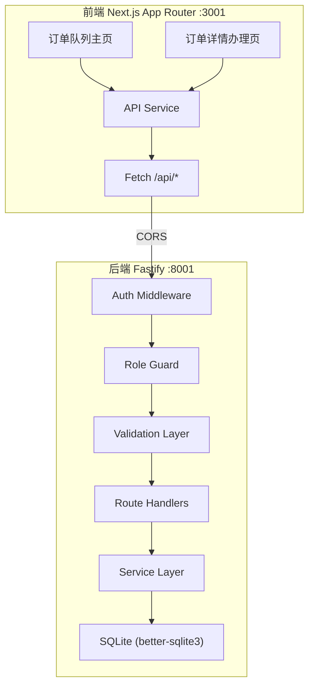
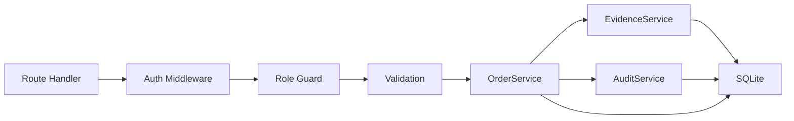
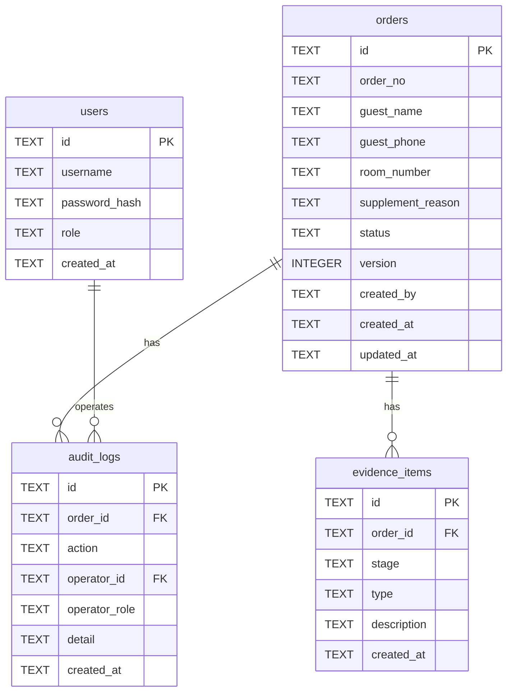

## 1. 架构设计



## 2. 技术说明

- 前端：Next.js 14 App Router + Tailwind CSS + Zustand
- 初始化工具：create-next-app
- 后端：Node.js + Fastify@4 + better-sqlite3
- 数据库：SQLite（本地文件 data.db）
- 前端端口：3001，后端端口：8001
- CORS：后端放行 http://localhost:3001

## 3. 路由定义

| 路由 | 用途 |
|------|------|
| / | 订单队列主页（列表+侧栏证据面板） |
| /orders/[id] | 订单详情办理页 |

## 4. API 定义

### 4.1 认证

```
POST /api/auth/login
  Body: { username: string, password: string }
  Response: { token: string, user: { id, username, role } }

GET /api/auth/me
  Headers: Authorization: Bearer <token>
  Response: { id, username, role }
```

### 4.2 订单

```
GET /api/orders?status=&role=
  Headers: Authorization: Bearer <token>
  Response: Order[]

GET /api/orders/:id
  Headers: Authorization: Bearer <token>
  Response: Order (含证据列表、操作记录)

POST /api/orders
  Headers: Authorization: Bearer <token>
  Body: { guestName, guestPhone, roomNumber, supplementReason }
  Response: Order

PUT /api/orders/:id/supplement
  Headers: Authorization: Bearer <token>
  Body: { version, guestName, guestPhone, roomNumber, supplementReason, evidenceItems: [{type, description}] }
  Response: Order | { error: string, reason: string }
  校验: role=receptionist, status=待补录, 必需登记证据, 版本匹配

PUT /api/orders/:id/verify
  Headers: Authorization: Bearer <token>
  Body: { version, verified: boolean, evidenceItems: [{type, description}], remark }
  Response: Order | { error: string, reason: string }
  校验: role=room_supervisor, status=待核验, 必需核验证据, 版本匹配

PUT /api/orders/:id/review
  Headers: Authorization: Bearer <token>
  Body: { version, approved: boolean, evidenceItems: [{type, description}], remark }
  Response: Order | { error: string, reason: string }
  校验: role=duty_manager, status=待复核, 必需归档证据, 版本匹配

POST /api/orders/batch-action
  Headers: Authorization: Bearer <token>
  Body: { orderIds: string[], action: "supplement"|"verify"|"review", ... }
  Response: { successes: string[], failures: {id, reason}[] }
```

### 4.3 TypeScript 类型定义

```typescript
type Role = "receptionist" | "room_supervisor" | "duty_manager"

type OrderStatus = "pending_supplement" | "pending_verification" | "pending_review" | "archived"

interface User {
  id: string
  username: string
  role: Role
}

interface EvidenceItem {
  id: string
  orderId: string
  stage: "registration" | "verification" | "archive"
  type: string
  description: string
  createdAt: string
}

interface AuditLog {
  id: string
  orderId: string
  action: string
  operatorId: string
  operatorRole: Role
  detail: string
  createdAt: string
}

interface Order {
  id: string
  orderNo: string
  guestName: string
  guestPhone: string
  roomNumber: string
  supplementReason: string
  status: OrderStatus
  version: number
  evidenceItems: EvidenceItem[]
  auditLogs: AuditLog[]
  createdBy: string
  createdAt: string
  updatedAt: string
}
```

## 5. 服务端架构



## 6. 数据模型

### 6.1 ER 图



### 6.2 DDL

```sql
CREATE TABLE users (
  id TEXT PRIMARY KEY,
  username TEXT NOT NULL UNIQUE,
  password_hash TEXT NOT NULL,
  role TEXT NOT NULL CHECK(role IN ('receptionist','room_supervisor','duty_manager')),
  created_at TEXT NOT NULL DEFAULT (datetime('now'))
);

CREATE TABLE orders (
  id TEXT PRIMARY KEY,
  order_no TEXT NOT NULL UNIQUE,
  guest_name TEXT NOT NULL,
  guest_phone TEXT,
  room_number TEXT,
  supplement_reason TEXT,
  status TEXT NOT NULL DEFAULT 'pending_supplement' CHECK(status IN ('pending_supplement','pending_verification','pending_review','archived')),
  version INTEGER NOT NULL DEFAULT 1,
  created_by TEXT NOT NULL REFERENCES users(id),
  created_at TEXT NOT NULL DEFAULT (datetime('now')),
  updated_at TEXT NOT NULL DEFAULT (datetime('now'))
);

CREATE TABLE evidence_items (
  id TEXT PRIMARY KEY,
  order_id TEXT NOT NULL REFERENCES orders(id) ON DELETE CASCADE,
  stage TEXT NOT NULL CHECK(stage IN ('registration','verification','archive')),
  type TEXT NOT NULL,
  description TEXT NOT NULL,
  created_at TEXT NOT NULL DEFAULT (datetime('now'))
);

CREATE TABLE audit_logs (
  id TEXT PRIMARY KEY,
  order_id TEXT NOT NULL REFERENCES orders(id) ON DELETE CASCADE,
  action TEXT NOT NULL,
  operator_id TEXT NOT NULL REFERENCES users(id),
  operator_role TEXT NOT NULL,
  detail TEXT NOT NULL,
  created_at TEXT NOT NULL DEFAULT (datetime('now'))
);
```

### 6.3 种子数据

演示账号：
| 用户名 | 密码 | 角色 |
|--------|------|------|
| receptionist1 | 123456 | receptionist |
| supervisor1 | 123456 | room_supervisor |
| manager1 | 123456 | duty_manager |

样例订单（见PRD第5节）随数据库初始化自动插入。
