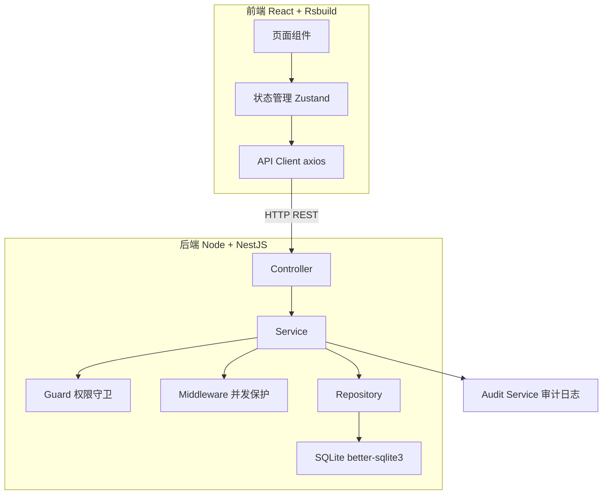
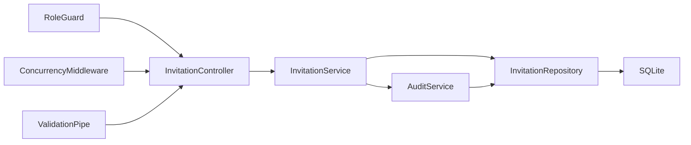
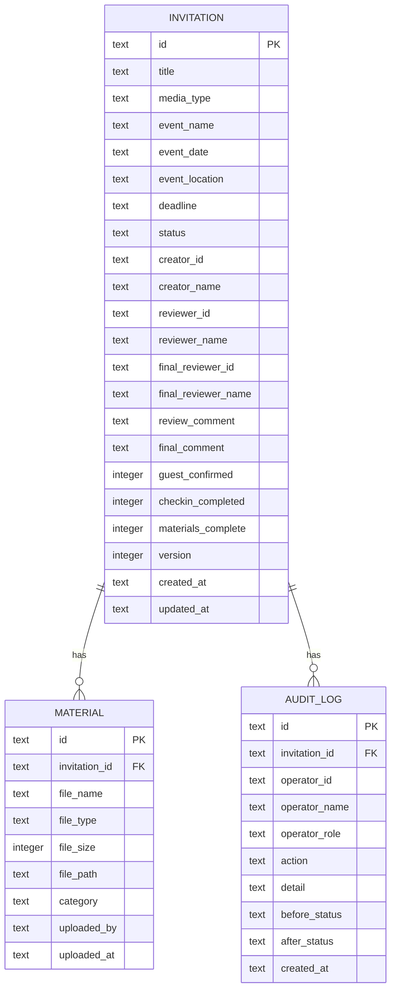

## 1. 架构设计



## 2. 技术说明

- 前端：React 18 + Rsbuild + TypeScript + TailwindCSS + Zustand + React Router + Ant Design
- 后端：Node.js + NestJS + TypeScript + better-sqlite3
- 数据库：SQLite（本地文件，通过better-sqlite3驱动）
- 端口：前端3004、后端8004，通过环境变量配置
- CORS：后端配置允许前端域名，通过环境变量配置

## 3. 路由定义

### 前端路由

| 路由 | 用途 |
|------|------|
| / | 工作台首页，按岗位展示待办和统计 |
| /invitations | 邀约单列表页，筛选+批量操作 |
| /invitations/:id | 邀约单详情页，按岗位展示表单 |
| /audit | 审计记录页 |

### 后端路由

| 方法 | 路由 | 用途 |
|------|------|------|
| GET | /api/invitations | 获取邀约单列表（支持筛选） |
| GET | /api/invitations/:id | 获取邀约单详情 |
| POST | /api/invitations | 登记员发起邀约单 |
| PUT | /api/invitations/:id | 更新邀约单（补正等） |
| POST | /api/invitations/:id/submit | 登记员提交审核 |
| POST | /api/invitations/:id/approve | 审核主管审核通过 |
| POST | /api/invitations/:id/reject | 审核主管退回补正 |
| POST | /api/invitations/:id/review | 复核负责人复核归档 |
| POST | /api/invitations/:id/review-reject | 复核负责人退回审核 |
| POST | /api/invitations/batch | 批量操作 |
| GET | /api/invitations/stats | 获取统计数据 |
| POST | /api/invitations/:id/materials | 上传材料附件 |
| POST | /api/invitations/:id/guest-confirm | 嘉宾确认 |
| POST | /api/invitations/:id/checkin-feedback | 签到反馈 |
| GET | /api/audit | 获取审计日志 |
| GET | /api/roles | 获取岗位列表 |

## 4. API定义

### 核心类型

```typescript
interface Invitation {
  id: string;
  title: string;
  mediaType: '电视' | '报纸' | '网络' | '自媒体' | '其他';
  eventName: string;
  eventDate: string;
  eventLocation: string;
  deadline: string;
  status: 'draft' | 'pending_review' | 'review_rejected' | 'pending_final' | 'final_rejected' | 'archived';
  creatorId: string;
  creatorName: string;
  reviewerId?: string;
  reviewerName?: string;
  finalReviewerId?: string;
  finalReviewerName?: string;
  reviewComment?: string;
  finalComment?: string;
  guestConfirmed: boolean;
  checkinCompleted: boolean;
  materialsComplete: boolean;
  version: number;
  createdAt: string;
  updatedAt: string;
}

interface Material {
  id: string;
  invitationId: string;
  fileName: string;
  fileType: string;
  fileSize: number;
  filePath: string;
  category: '邀请函' | '媒体资料' | '活动方案' | '其他';
  uploadedBy: string;
  uploadedAt: string;
}

interface AuditLog {
  id: string;
  invitationId: string;
  operatorId: string;
  operatorName: string;
  operatorRole: string;
  action: string;
  detail: string;
  beforeStatus?: string;
  afterStatus?: string;
  createdAt: string;
}
```

### 请求/响应

```typescript
// 发起邀约单
POST /api/invitations
Body: { title, mediaType, eventName, eventDate, eventLocation, deadline }
Response: Invitation

// 提交审核
POST /api/invitations/:id/submit
Body: { operatorId, operatorRole: 'registrar' }
Response: Invitation

// 审核通过
POST /api/invitations/:id/approve
Body: { operatorId, operatorRole: 'reviewer', reviewComment, guestConfirmed }
Response: Invitation

// 退回补正
POST /api/invitations/:id/reject
Body: { operatorId, operatorRole: 'reviewer', reviewComment }
Response: Invitation

// 复核归档
POST /api/invitations/:id/review
Body: { operatorId, operatorRole: 'final_reviewer', finalComment, checkinCompleted }
Response: Invitation

// 退回审核
POST /api/invitations/:id/review-reject
Body: { operatorId, operatorRole: 'final_reviewer', finalComment }
Response: Invitation

// 批量操作
POST /api/invitations/batch
Body: { ids: string[], action: 'approve' | 'reject' | 'review' | 'review-reject', operatorId, operatorRole, comment }
Response: { success: string[], failed: { id: string, reason: string }[] }

// 获取列表
GET /api/invitations?status=&urgency=&keyword=&page=&pageSize=&role=
Response: { total: number, items: Invitation[] }

// 统计
GET /api/invitations/stats?role=
Response: { total, draft, pendingReview, reviewRejected, pendingFinal, finalRejected, archived, urgent, overdue }
```

## 5. 服务端架构图



## 6. 数据模型

### 6.1 ER图



### 6.2 DDL

```sql
CREATE TABLE invitation (
  id TEXT PRIMARY KEY,
  title TEXT NOT NULL,
  media_type TEXT NOT NULL CHECK(media_type IN ('电视','报纸','网络','自媒体','其他')),
  event_name TEXT NOT NULL,
  event_date TEXT NOT NULL,
  event_location TEXT NOT NULL,
  deadline TEXT NOT NULL,
  status TEXT NOT NULL DEFAULT 'draft' CHECK(status IN ('draft','pending_review','review_rejected','pending_final','final_rejected','archived')),
  creator_id TEXT NOT NULL,
  creator_name TEXT NOT NULL,
  reviewer_id TEXT,
  reviewer_name TEXT,
  final_reviewer_id TEXT,
  final_reviewer_name TEXT,
  review_comment TEXT,
  final_comment TEXT,
  guest_confirmed INTEGER NOT NULL DEFAULT 0,
  checkin_completed INTEGER NOT NULL DEFAULT 0,
  materials_complete INTEGER NOT NULL DEFAULT 0,
  version INTEGER NOT NULL DEFAULT 1,
  created_at TEXT NOT NULL DEFAULT (datetime('now')),
  updated_at TEXT NOT NULL DEFAULT (datetime('now'))
);

CREATE TABLE material (
  id TEXT PRIMARY KEY,
  invitation_id TEXT NOT NULL,
  file_name TEXT NOT NULL,
  file_type TEXT NOT NULL,
  file_size INTEGER NOT NULL DEFAULT 0,
  file_path TEXT NOT NULL,
  category TEXT NOT NULL CHECK(category IN ('邀请函','媒体资料','活动方案','其他')),
  uploaded_by TEXT NOT NULL,
  uploaded_at TEXT NOT NULL DEFAULT (datetime('now')),
  FOREIGN KEY (invitation_id) REFERENCES invitation(id) ON DELETE CASCADE
);

CREATE TABLE audit_log (
  id TEXT PRIMARY KEY,
  invitation_id TEXT NOT NULL,
  operator_id TEXT NOT NULL,
  operator_name TEXT NOT NULL,
  operator_role TEXT NOT NULL,
  action TEXT NOT NULL,
  detail TEXT NOT NULL,
  before_status TEXT,
  after_status TEXT,
  created_at TEXT NOT NULL DEFAULT (datetime('now')),
  FOREIGN KEY (invitation_id) REFERENCES invitation(id) ON DELETE CASCADE
);

CREATE INDEX idx_invitation_status ON invitation(status);
CREATE INDEX idx_invitation_deadline ON invitation(deadline);
CREATE INDEX idx_invitation_creator ON invitation(creator_id);
CREATE INDEX idx_audit_invitation ON audit_log(invitation_id);
CREATE INDEX idx_audit_created ON audit_log(created_at);
```
