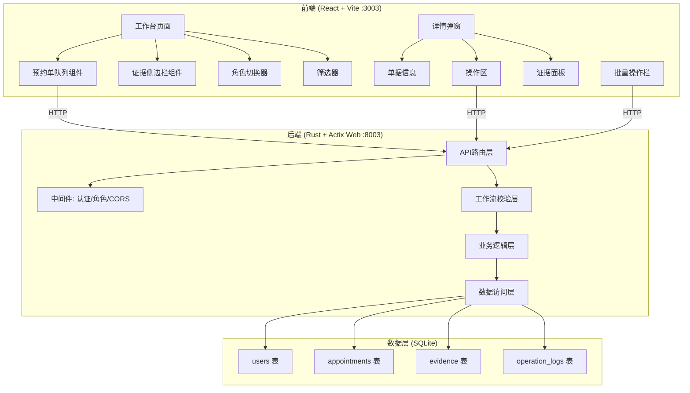
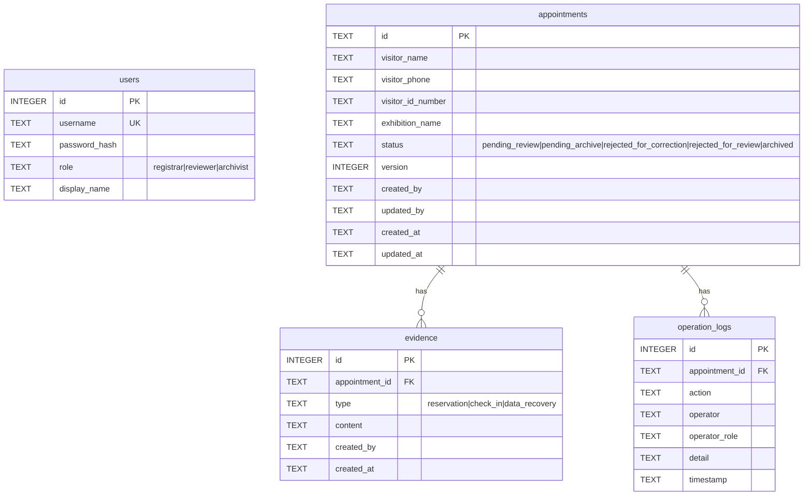

## 1. 架构设计



## 2. 技术说明

- 前端：React@18 + TypeScript + Vite + Tailwind CSS + Zustand + lucide-react
- 初始化工具：vite-init (react-ts 模板)
- 后端：Rust + Actix Web 4 + rusqlite + serde + tokio
- 数据库：SQLite（本地文件 data.db）
- 前端端口：3003，后端端口：8003
- CORS：后端放行 http://localhost:3003

## 3. 路由定义

| 路由 | 用途 |
|------|------|
| `/` | 预约单工作台（首页） |

前端为单页应用，预约单详情通过弹窗/抽屉展示，无独立路由。

## 4. API 定义

### 4.1 认证

```
POST /api/auth/login
  请求: { username: string, password: string }
  响应: { token: string, role: "registrar"|"reviewer"|"archivist", display_name: string }

GET /api/auth/me
  请求头: Authorization: Bearer <token>
  响应: { username: string, role: string, display_name: string }
```

### 4.2 预约单

```
GET /api/appointments?status=待审核&page=1&page_size=20
  响应: { list: Appointment[], total: number, page: number }

GET /api/appointments/:id
  响应: AppointmentDetail (含证据链、版本历史、操作日志)

POST /api/appointments
  请求: CreateAppointmentBody
  响应: { id: string, version: number }
  错误: { code: "ROLE_MISMATCH"|"DUPLICATE", message: string }

PUT /api/appointments/:id/correct
  请求: CorrectAppointmentBody { version: number, ...fields }
  响应: { id: string, version: number }
  错误: { code: "ROLE_MISMATCH"|"VERSION_CONFLICT"|"WRONG_STATUS", message: string }

PUT /api/appointments/:id/review
  请求: { action: "approve"|"reject", version: number, comment?: string }
  响应: { id: string, status: string, version: number }
  错误: { code: "ROLE_MISMATCH"|"VERSION_CONFLICT"|"MISSING_EVIDENCE"|"WRONG_STATUS", message: string }

PUT /api/appointments/:id/archive
  请求: { action: "archive"|"reject", version: number, comment?: string }
  响应: { id: string, status: string, version: number }
  错误: { code: "ROLE_MISMATCH"|"VERSION_CONFLICT"|"MISSING_EVIDENCE"|"WRONG_STATUS", message: string }

POST /api/appointments/batch-review
  请求: { ids: string[], action: "approve"|"reject", comment?: string }
  响应: { results: { id: string, success: boolean, error?: string }[] }

POST /api/appointments/batch-archive
  请求: { ids: string[], action: "archive"|"reject", comment?: string }
  响应: { results: { id: string, success: boolean, error?: string }[] }
```

### 4.3 证据

```
GET /api/appointments/:id/evidence
  响应: { reservation: Evidence[], check_in: Evidence[], data_recovery: Evidence[] }

POST /api/appointments/:id/evidence
  请求: { type: "reservation"|"check_in"|"data_recovery", content: string }
  响应: { id: string, type: string }
  错误: { code: "ROLE_MISMATCH"|"WRONG_STATUS", message: string }
```

### 4.4 TypeScript 类型定义

```typescript
interface Appointment {
  id: string
  visitor_name: string
  visitor_phone: string
  visitor_id_number: string
  exhibition_name: string
  status: "pending_review" | "pending_archive" | "rejected_for_correction" | "rejected_for_review" | "archived"
  current_handler_role: "registrar" | "reviewer" | "archivist"
  version: number
  created_at: string
  updated_at: string
}

interface AppointmentDetail extends Appointment {
  evidence: {
    reservation: Evidence[]
    check_in: Evidence[]
    data_recovery: Evidence[]
  }
  version_history: VersionRecord[]
  operation_logs: OperationLog[]
}

interface Evidence {
  id: string
  appointment_id: string
  type: "reservation" | "check_in" | "data_recovery"
  content: string
  created_at: string
  created_by: string
}

interface VersionRecord {
  version: number
  action: string
  operator: string
  operator_role: string
  timestamp: string
  changes: string
}

interface OperationLog {
  id: string
  appointment_id: string
  action: string
  operator: string
  operator_role: string
  timestamp: string
  detail: string
}

interface ApiError {
  code: "ROLE_MISMATCH" | "VERSION_CONFLICT" | "MISSING_EVIDENCE" | "WRONG_STATUS" | "DUPLICATE" | "NOT_FOUND"
  message: string
}
```

## 5. 服务端架构图

```mermaid
graph LR
    "Actix Web 路由" --> "认证中间件"
    "认证中间件" --> "角色校验中间件"
    "角色校验中间件" --> "工作流校验"
    "工作流校验" --> "业务逻辑 Service"
    "业务逻辑 Service" --> "数据访问 Repository"
    "数据访问 Repository" --> "SQLite (rusqlite)"
```

### 工作流校验层核心逻辑

1. **角色匹配校验**：每个操作端点绑定允许的角色，不匹配返回 `ROLE_MISMATCH`
2. **状态校验**：操作只能对正确状态的单据执行，否则返回 `WRONG_STATUS`
3. **证据完整性校验**：审核和复核环节检查证据链，缺失返回 `MISSING_EVIDENCE`
4. **版本冲突校验**：补正/审核/复核时携带 version，与数据库不匹配返回 `VERSION_CONFLICT`
5. **重复提交校验**：发起时检查同身份证+同展会是否已存在未归档单据，返回 `DUPLICATE`

## 6. 数据模型

### 6.1 数据模型定义



### 6.2 数据定义语言

```sql
CREATE TABLE IF NOT EXISTS users (
    id INTEGER PRIMARY KEY AUTOINCREMENT,
    username TEXT NOT NULL UNIQUE,
    password_hash TEXT NOT NULL,
    role TEXT NOT NULL CHECK(role IN ('registrar', 'reviewer', 'archivist')),
    display_name TEXT NOT NULL
);

CREATE TABLE IF NOT EXISTS appointments (
    id TEXT PRIMARY KEY,
    visitor_name TEXT NOT NULL,
    visitor_phone TEXT NOT NULL,
    visitor_id_number TEXT NOT NULL,
    exhibition_name TEXT NOT NULL,
    status TEXT NOT NULL CHECK(status IN ('pending_review', 'pending_archive', 'rejected_for_correction', 'rejected_for_review', 'archived')),
    version INTEGER NOT NULL DEFAULT 1,
    created_by TEXT NOT NULL,
    updated_by TEXT NOT NULL,
    created_at TEXT NOT NULL,
    updated_at TEXT NOT NULL
);

CREATE TABLE IF NOT EXISTS evidence (
    id INTEGER PRIMARY KEY AUTOINCREMENT,
    appointment_id TEXT NOT NULL REFERENCES appointments(id),
    type TEXT NOT NULL CHECK(type IN ('reservation', 'check_in', 'data_recovery')),
    content TEXT NOT NULL,
    created_by TEXT NOT NULL,
    created_at TEXT NOT NULL
);

CREATE TABLE IF NOT EXISTS operation_logs (
    id INTEGER PRIMARY KEY AUTOINCREMENT,
    appointment_id TEXT NOT NULL REFERENCES appointments(id),
    action TEXT NOT NULL,
    operator TEXT NOT NULL,
    operator_role TEXT NOT NULL,
    detail TEXT NOT NULL DEFAULT '',
    timestamp TEXT NOT NULL
);

CREATE INDEX IF NOT EXISTS idx_appointments_status ON appointments(status);
CREATE INDEX IF NOT EXISTS idx_appointments_created_by ON appointments(created_by);
CREATE INDEX IF NOT EXISTS idx_evidence_appointment_id ON evidence(appointment_id);
CREATE INDEX IF NOT EXISTS idx_operation_logs_appointment_id ON operation_logs(appointment_id);
CREATE INDEX IF NOT EXISTS idx_appointments_visitor_id ON appointments(visitor_id_number, exhibition_name);

-- 演示账号
INSERT INTO users (username, password_hash, role, display_name) VALUES
    ('registrar1', 'sha256$salt$hash', 'registrar', '登记员-张三'),
    ('reviewer1', 'sha256$salt$hash', 'reviewer', '审核主管-李四'),
    ('archivist1', 'sha256$salt$hash', 'archivist', '复核负责人-王五');
```
