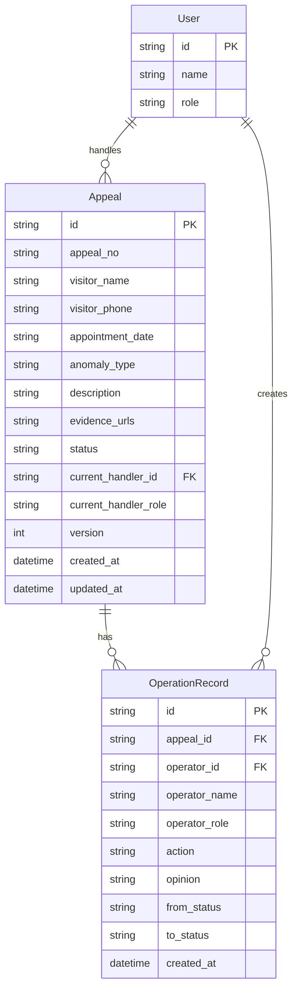

## 1. 架构设计

```mermaid
graph TB
    subgraph "前端层"
        "R[Remix 前端 :3003"]
    end
    subgraph "后端层"
        "A[Litestar API :8003"]
    end
    subgraph "数据层"
        "DB[SQLite 本地文件]"
    end
    "R" -->|"HTTP/JSON"| "A"
    "A" -->|"SQLAlchemy"| "DB"
```

前后端分离架构：Remix 前端通过 fetch 调用 Litestar 后端 REST API，后端使用 SQLAlchemy 操作本地 SQLite 文件。

## 2. 技术说明

- 前端：Remix (React) + TailwindCSS，端口 3003
- 后端：Python Litestar + SQLAlchemy，端口 8003
- 数据库：SQLite 本地文件 (`backend/data.db`)
- 无外部服务依赖

## 3. 路由定义

| 路由 | 用途 |
|------|------|
| `/` | 申诉队列首页，显示统计和列表 |
| `/appeals/new` | 发起新申诉 |
| `/appeals/:id` | 申诉详情页，含操作记录和处理表单 |

## 4. API 定义

### 4.1 申诉管理

```
GET    /api/appeals              # 获取申诉列表，支持 ?status= 筛选
GET    /api/appeals/:id          # 获取申诉详情（含操作记录）
POST   /api/appeals              # 发起申诉
POST   /api/appeals/:id/process  # 处理申诉（审核/复核）
POST   /api/appeals/:id/resubmit # 补正再次提交
```

### 4.2 统计

```
GET    /api/stats                # 获取各状态计数统计
```

### 4.3 用户/角色

```
GET    /api/users                # 获取用户列表（含角色）
```

### 4.4 请求/响应类型

```typescript
interface Appeal {
  id: string
  appeal_no: string
  visitor_name: string
  visitor_phone: string
  appointment_date: string
  anomaly_type: "normal" | "missing_evidence" | "overdue" | "returned" | "status_conflict"
  description: string
  evidence_urls: string[]
  status: "pending_review" | "pending_recheck" | "returned" | "rejected" | "archived"
  current_handler_id: string
  current_handler_name: string
  current_handler_role: "registrar" | "reviewer" | "rechecker"
  version: number
  created_at: string
  updated_at: string
}

interface OperationRecord {
  id: string
  appeal_id: string
  operator_id: string
  operator_name: string
  operator_role: "registrar" | "reviewer" | "rechecker"
  action: "submit" | "approve" | "reject" | "return" | "resubmit" | "archive"
  opinion: string
  from_status: string
  to_status: string
  created_at: string
}

interface ProcessRequest {
  operator_id: string
  action: "approve" | "reject" | "return"
  opinion: string
  version: number
}

interface Stats {
  total: number
  pending_review: number
  pending_recheck: number
  returned: number
  rejected: number
  archived: number
}
```

## 5. 服务端架构图

```mermaid
graph LR
    "C[Controller 路由层]" --> "S[Service 业务层]"
    "S" --> "R[Repository 数据层]"
    "R" --> "DB[SQLite]"
```

- Controller：Litestar 路由控制器，参数校验
- Service：业务逻辑，状态流转校验（处理人、角色、状态、版本、必填证据）
- Repository：SQLAlchemy 数据访问

## 6. 数据模型

### 6.1 数据模型定义



### 6.2 数据定义语言

```sql
CREATE TABLE users (
    id TEXT PRIMARY KEY,
    name TEXT NOT NULL,
    role TEXT NOT NULL CHECK(role IN ('registrar', 'reviewer', 'rechecker'))
);

CREATE TABLE appeals (
    id TEXT PRIMARY KEY,
    appeal_no TEXT NOT NULL UNIQUE,
    visitor_name TEXT NOT NULL,
    visitor_phone TEXT NOT NULL,
    appointment_date TEXT NOT NULL,
    anomaly_type TEXT NOT NULL CHECK(anomaly_type IN ('normal', 'missing_evidence', 'overdue', 'returned', 'status_conflict')),
    description TEXT NOT NULL,
    evidence_urls TEXT NOT NULL DEFAULT '[]',
    status TEXT NOT NULL DEFAULT 'pending_review' CHECK(status IN ('pending_review', 'pending_recheck', 'returned', 'rejected', 'archived')),
    current_handler_id TEXT NOT NULL,
    current_handler_role TEXT NOT NULL CHECK(current_handler_role IN ('registrar', 'reviewer', 'rechecker')),
    version INTEGER NOT NULL DEFAULT 1,
    created_at TEXT NOT NULL DEFAULT (datetime('now')),
    updated_at TEXT NOT NULL DEFAULT (datetime('now')),
    FOREIGN KEY (current_handler_id) REFERENCES users(id)
);

CREATE TABLE operation_records (
    id TEXT PRIMARY KEY,
    appeal_id TEXT NOT NULL,
    operator_id TEXT NOT NULL,
    operator_name TEXT NOT NULL,
    operator_role TEXT NOT NULL CHECK(operator_role IN ('registrar', 'reviewer', 'rechecker')),
    action TEXT NOT NULL CHECK(action IN ('submit', 'approve', 'reject', 'return', 'resubmit', 'archive')),
    opinion TEXT NOT NULL DEFAULT '',
    from_status TEXT NOT NULL,
    to_status TEXT NOT NULL,
    created_at TEXT NOT NULL DEFAULT (datetime('now')),
    FOREIGN KEY (appeal_id) REFERENCES appeals(id),
    FOREIGN KEY (operator_id) REFERENCES users(id)
);

CREATE INDEX idx_appeals_status ON appeals(status);
CREATE INDEX idx_appeals_handler ON appeals(current_handler_id);
CREATE INDEX idx_operation_records_appeal ON operation_records(appeal_id);

-- 预设用户
INSERT INTO users (id, name, role) VALUES ('u1', '张登记', 'registrar');
INSERT INTO users (id, name, role) VALUES ('u2', '李审核', 'reviewer');
INSERT INTO users (id, name, role) VALUES ('u3', '王复核', 'rechecker');

-- 样例数据：正常通过
INSERT INTO appeals (id, appeal_no, visitor_name, visitor_phone, appointment_date, anomaly_type, description, evidence_urls, status, current_handler_id, current_handler_role, version)
VALUES ('a1', 'VZ-2026-001', '陈明', '13800001111', '2026-06-15', 'normal', '访客正常预约，现场核验无误', '["预约截图.png"]', 'archived', 'u3', 'rechecker', 3);

INSERT INTO operation_records (id, appeal_id, operator_id, operator_name, operator_role, action, opinion, from_status, to_status)
VALUES ('r1', 'a1', 'u1', '张登记', 'registrar', 'submit', '访客已到场，材料齐全', '', 'pending_review');
INSERT INTO operation_records (id, appeal_id, operator_id, operator_name, operator_role, action, opinion, from_status, to_status)
VALUES ('r2', 'a1', 'u2', '李审核', 'reviewer', 'approve', '核验通过，转复核', 'pending_review', 'pending_recheck');
INSERT INTO operation_records (id, appeal_id, operator_id, operator_name, operator_role, action, opinion, from_status, to_status)
VALUES ('r3', 'a1', 'u3', '王复核', 'rechecker', 'archive', '复核无异议，归档', 'pending_recheck', 'archived');

-- 样例数据：缺证据
INSERT INTO appeals (id, appeal_no, visitor_name, visitor_phone, appointment_date, anomaly_type, description, evidence_urls, status, current_handler_id, current_handler_role, version)
VALUES ('a2', 'VZ-2026-002', '林芳', '13800002222', '2026-06-16', 'missing_evidence', '访客预约记录缺少审批截图', '[]', 'pending_review', 'u2', 'reviewer', 1);

INSERT INTO operation_records (id, appeal_id, operator_id, operator_name, operator_role, action, opinion, from_status, to_status)
VALUES ('r4', 'a2', 'u1', '张登记', 'registrar', 'submit', '预约已登记但审批截图遗失', '', 'pending_review');

-- 样例数据：逾期
INSERT INTO appeals (id, appeal_no, visitor_name, visitor_phone, appointment_date, anomaly_type, description, evidence_urls, status, current_handler_id, current_handler_role, version)
VALUES ('a3', 'VZ-2026-003', '赵强', '13800003333', '2026-06-10', 'overdue', '访客预约日期已过，需申诉延期处理', '["原预约记录.pdf"]', 'pending_recheck', 'u3', 'rechecker', 2);

INSERT INTO operation_records (id, appeal_id, operator_id, operator_name, operator_role, action, opinion, from_status, to_status)
VALUES ('r5', 'a3', 'u1', '张登记', 'registrar', 'submit', '预约已逾期，申请特殊处理', '', 'pending_review');
INSERT INTO operation_records (id, appeal_id, operator_id, operator_name, operator_role, action, opinion, from_status, to_status)
VALUES ('r6', 'a3', 'u2', '李审核', 'reviewer', 'approve', '逾期原因合理，同意转复核', 'pending_review', 'pending_recheck');

-- 样例数据：退回补正
INSERT INTO appeals (id, appeal_no, visitor_name, visitor_phone, appointment_date, anomaly_type, description, evidence_urls, status, current_handler_id, current_handler_role, version)
VALUES ('a4', 'VZ-2026-004', '周丽', '13800004444', '2026-06-17', 'returned', '访客信息与系统记录不一致，需补正身份证照片', '["预约截图.png"]', 'returned', 'u1', 'registrar', 2);

INSERT INTO operation_records (id, appeal_id, operator_id, operator_name, operator_role, action, opinion, from_status, to_status)
VALUES ('r7', 'a4', 'u1', '张登记', 'registrar', 'submit', '访客已到场登记', '', 'pending_review');
INSERT INTO operation_records (id, appeal_id, operator_id, operator_name, operator_role, action, opinion, from_status, to_status)
VALUES ('r8', 'a4', 'u2', '李审核', 'reviewer', 'return', '身份证照片缺失，请补正后重新提交', 'pending_review', 'returned');

-- 样例数据：状态冲突
INSERT INTO appeals (id, appeal_no, visitor_name, visitor_phone, appointment_date, anomaly_type, description, evidence_urls, status, current_handler_id, current_handler_role, version)
VALUES ('a5', 'VZ-2026-005', '吴刚', '13800005555', '2026-06-18', 'status_conflict', '系统显示访客已签到但预约已被取消', '["系统截图.png", "签到记录.pdf"]', 'rejected', 'u1', 'registrar', 3);

INSERT INTO operation_records (id, appeal_id, operator_id, operator_name, operator_role, action, opinion, from_status, to_status)
VALUES ('r9', 'a5', 'u1', '张登记', 'registrar', 'submit', '系统状态异常，访客已签到但预约被取消', '', 'pending_review');
INSERT INTO operation_records (id, appeal_id, operator_id, operator_name, operator_role, action, opinion, from_status, to_status)
VALUES ('r10', 'a5', 'u2', '李审核', 'reviewer', 'approve', '状态冲突属实，转复核确认', 'pending_review', 'pending_recheck');
INSERT INTO operation_records (id, appeal_id, operator_id, operator_name, operator_role, action, opinion, from_status, to_status)
VALUES ('r11', 'a5', 'u3', '王复核', 'rechecker', 'reject', '该预约属系统自动取消，不可恢复，驳回申诉', 'pending_recheck', 'rejected');
```
