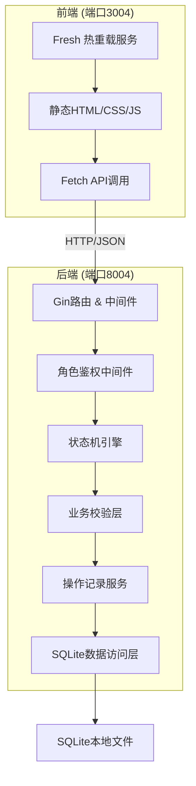
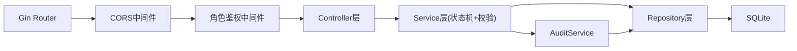
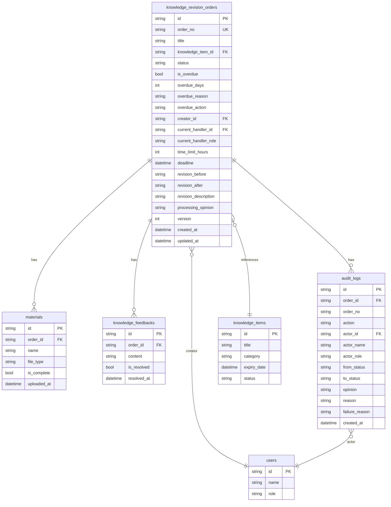

## 1. 架构设计



## 2. 技术说明

- 前端：纯 HTML + CSS + JavaScript（无框架依赖），使用 Fetch API 调用后端
- 前端开发服务：Go 内置文件服务或 Fresh 热重载工具，端口 3004
- 后端：Go 1.21+ / Gin v1.9+
- 数据库：SQLite 3（本地文件存储，使用 mattn/go-sqlite3 驱动）
- 端口与 CORS：通过环境变量或配置文件读取，不写死

## 3. 路由定义

| 路由 | 方法 | 用途 |
|------|------|------|
| /api/auth/switch-role | POST | 切换当前角色（模拟登录） |
| /api/orders | GET | 获取修订单列表（支持筛选/分页） |
| /api/orders | POST | 发起修订单 |
| /api/orders/:id | GET | 获取修订单详情 |
| /api/orders/:id/advance | POST | 推进修订单（审核通过/复核通过） |
| /api/orders/:id/return | POST | 退回修订单（审核退回/复核退回） |
| /api/orders/:id/correct | POST | 补正修订单 |
| /api/orders/batch-advance | POST | 批量推进 |
| /api/orders/batch-return | POST | 批量退回 |
| /api/stats | GET | 获取统计数据 |
| /api/audit-logs | GET | 获取审计日志 |
| /api/knowledge-items | GET | 获取知识库条目列表（关联用） |

## 4. API定义

### 4.1 数据类型

```typescript
interface KnowledgeRevisionOrder {
  id: string
  order_no: string
  title: string
  knowledge_item_id: string
  knowledge_item_title: string
  status: "draft" | "pending_review" | "pending_correction" | "pending_final_review" | "review_returned" | "final_review_returned" | "archived"
  is_overdue: boolean
  overdue_days: number
  overdue_reason: string
  overdue_action: string
  creator_id: string
  creator_name: string
  current_handler_id: string
  current_handler_name: string
  current_handler_role: "clerk" | "supervisor" | "reviewer"
  materials: Material[]
  feedback: KnowledgeFeedback[]
  revision_content: RevisionContent
  time_limit_hours: number
  deadline: string
  processing_opinion: string
  version: number
  created_at: string
  updated_at: string
}

interface Material {
  id: string
  name: string
  file_type: string
  is_complete: boolean
  uploaded_at: string
}

interface KnowledgeFeedback {
  id: string
  content: string
  is_resolved: boolean
  resolved_at: string | null
}

interface RevisionContent {
  before: string
  after: string
  description: string
}

interface AuditLog {
  id: string
  order_id: string
  order_no: string
  action: "create" | "advance" | "return" | "correct" | "overdue_process" | "batch_advance" | "batch_return"
  actor_id: string
  actor_name: string
  actor_role: string
  from_status: string
  to_status: string
  opinion: string
  reason: string
  failure_reason: string
  created_at: string
}

interface Stats {
  total: number
  pending_review: number
  pending_correction: number
  pending_final_review: number
  archived: number
  overdue: number
}
```

### 4.2 请求/响应模式

- 推进请求：`{ opinion: string, version: number }` — opinion必填，version用于乐观锁
- 退回请求：`{ reason: string, version: number }` — reason必填
- 补正请求：`{ materials: Material[], revision_content: RevisionContent, correction_note: string, version: number }`
- 逾期处理请求：`{ overdue_reason: string, overdue_action: string, opinion: string, version: number }`
- 批量操作请求：`{ order_ids: string[], opinion_or_reason: string }`
- 统一错误响应：`{ code: number, message: string, detail: string }`

## 5. 服务端架构图



**中间件链**：
1. CORS中间件：读取配置的允许源
2. 角色鉴权中间件：从请求头读取X-Role，校验该角色是否有权访问目标路由
3. 乐观锁中间件：推进/退回/补正操作时校验version字段

**状态机核心逻辑**：
- 定义合法状态转换表：`{from_status, to_status, required_role}` 
- 每次操作前校验：状态转换合法性 + 角色权限 + 材料齐全性 + 反馈处理状态 + 逾期状态
- 校验失败返回明确错误码和原因，不静默推进

## 6. 数据模型

### 6.1 数据模型定义



### 6.2 数据定义语言

```sql
CREATE TABLE users (
    id TEXT PRIMARY KEY,
    name TEXT NOT NULL,
    role TEXT NOT NULL CHECK(role IN ('clerk', 'supervisor', 'reviewer'))
);

CREATE TABLE knowledge_items (
    id TEXT PRIMARY KEY,
    title TEXT NOT NULL,
    category TEXT NOT NULL,
    expiry_date DATETIME NOT NULL,
    status TEXT NOT NULL DEFAULT 'active'
);

CREATE TABLE knowledge_revision_orders (
    id TEXT PRIMARY KEY,
    order_no TEXT NOT NULL UNIQUE,
    title TEXT NOT NULL,
    knowledge_item_id TEXT NOT NULL REFERENCES knowledge_items(id),
    status TEXT NOT NULL DEFAULT 'pending_review' CHECK(status IN ('draft','pending_review','pending_correction','pending_final_review','archived')),
    is_overdue BOOLEAN NOT NULL DEFAULT 0,
    overdue_days INTEGER NOT NULL DEFAULT 0,
    overdue_reason TEXT DEFAULT '',
    overdue_action TEXT DEFAULT '',
    creator_id TEXT NOT NULL REFERENCES users(id),
    current_handler_id TEXT NOT NULL REFERENCES users(id),
    current_handler_role TEXT NOT NULL CHECK(current_handler_role IN ('clerk','supervisor','reviewer')),
    time_limit_hours INTEGER NOT NULL DEFAULT 72,
    deadline DATETIME NOT NULL,
    revision_before TEXT DEFAULT '',
    revision_after TEXT DEFAULT '',
    revision_description TEXT DEFAULT '',
    processing_opinion TEXT DEFAULT '',
    version INTEGER NOT NULL DEFAULT 1,
    created_at DATETIME NOT NULL DEFAULT CURRENT_TIMESTAMP,
    updated_at DATETIME NOT NULL DEFAULT CURRENT_TIMESTAMP
);

CREATE TABLE materials (
    id TEXT PRIMARY KEY,
    order_id TEXT NOT NULL REFERENCES knowledge_revision_orders(id) ON DELETE CASCADE,
    name TEXT NOT NULL,
    file_type TEXT NOT NULL DEFAULT 'document',
    is_complete BOOLEAN NOT NULL DEFAULT 0,
    uploaded_at DATETIME NOT NULL DEFAULT CURRENT_TIMESTAMP
);

CREATE TABLE knowledge_feedbacks (
    id TEXT PRIMARY KEY,
    order_id TEXT NOT NULL REFERENCES knowledge_revision_orders(id) ON DELETE CASCADE,
    content TEXT NOT NULL,
    is_resolved BOOLEAN NOT NULL DEFAULT 0,
    resolved_at DATETIME
);

CREATE TABLE audit_logs (
    id TEXT PRIMARY KEY,
    order_id TEXT NOT NULL REFERENCES knowledge_revision_orders(id),
    order_no TEXT NOT NULL,
    action TEXT NOT NULL CHECK(action IN ('create','advance','return','correct','overdue_process','batch_advance','batch_return')),
    actor_id TEXT NOT NULL REFERENCES users(id),
    actor_name TEXT NOT NULL,
    actor_role TEXT NOT NULL,
    from_status TEXT NOT NULL,
    to_status TEXT NOT NULL,
    opinion TEXT DEFAULT '',
    reason TEXT DEFAULT '',
    failure_reason TEXT DEFAULT '',
    created_at DATETIME NOT NULL DEFAULT CURRENT_TIMESTAMP
);

CREATE INDEX idx_orders_status ON knowledge_revision_orders(status);
CREATE INDEX idx_orders_creator ON knowledge_revision_orders(creator_id);
CREATE INDEX idx_orders_handler_role ON knowledge_revision_orders(current_handler_role);
CREATE INDEX idx_orders_overdue ON knowledge_revision_orders(is_overdue);
CREATE INDEX idx_audit_order ON audit_logs(order_id);
CREATE INDEX idx_audit_actor ON audit_logs(actor_id);
CREATE INDEX idx_audit_created ON audit_logs(created_at);
```
