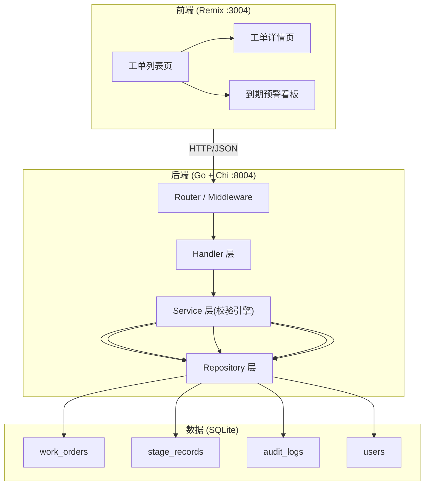
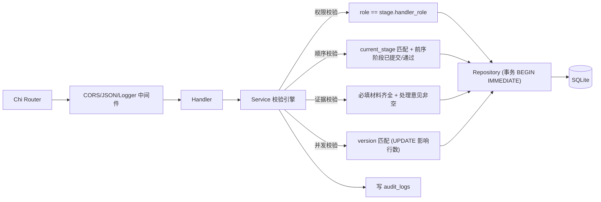
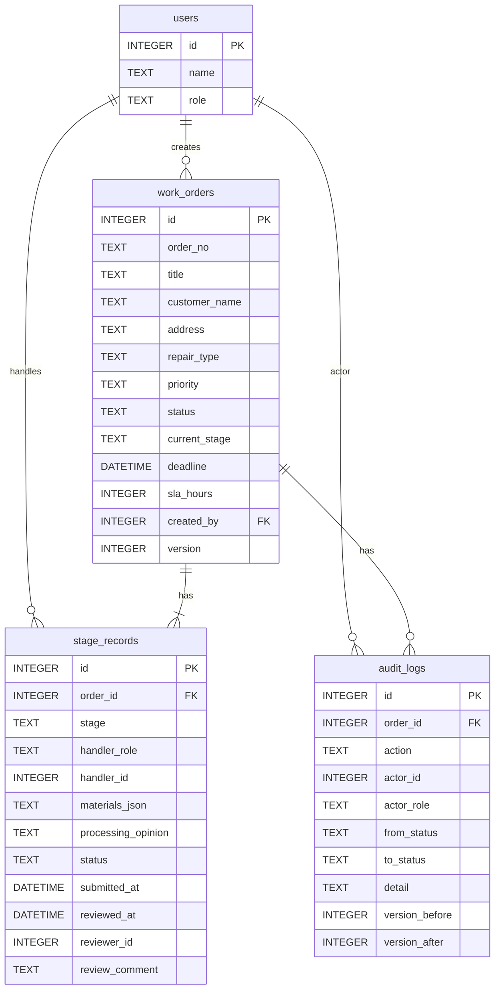

# 水务营业厅抢修工单系统 技术架构文档

## 1. 架构设计



## 2. 技术说明

- 前端：Remix（React 18）+ TypeScript + Tailwind CSS；端口 3004，通过 `PORT` 环境变量可改
- 后端：Go 1.22 + Chi(v5) 路由；端口 8004，通过 `PORT` 环境变量可改；CORS 来源通过 `CORS_ORIGIN` 环境变量配置，不写死
- 数据库：本地 SQLite（modernc.org/sqlite，纯 Go 驱动免 CGO），文件 `data/water_work_order.db`
- 启动命令可配置：后端 `PORT=8004 CORS_ORIGIN=http://localhost:3004 go run ./cmd/server`；前端 `PORT=3004 npm run dev`
- 校验引擎：统一在 Service 层做权限/顺序/证据/并发四重校验，Handler 只做参数解析与响应

## 3. 路由定义

| 路由 | 用途 |
|------|------|
| `/` | 工单列表页（含岗位切换、状态队列、批量处理） |
| `/orders/:id` | 工单详情页（三阶段、预警档位、审计） |
| `/warnings` | 到期预警看板（临期/逾期分栏） |

## 4. API 定义

| 方法 | 路径 | 用途 | 请求体/参数 |
|------|------|------|-------------|
| GET | `/api/users` | 岗位用户列表（用于切换岗位） | - |
| GET | `/api/orders` | 工单列表 | query: role, status, stage, warning |
| GET | `/api/orders/:id` | 工单详情（含阶段、审计、预警计算） | - |
| POST | `/api/orders` | 建单（窗口人员） | `{title,customerName,phone,address,repairType,priority,slaHours,materials}` |
| POST | `/api/orders/:id/stages/:stage` | 提交/审阅阶段 | `{action:submit/approve/reject, materials, processingOpinion, reviewComment, version}` |
| POST | `/api/orders/batch` | 批量处理 | `{ids:[], action, role, reviewComment}` |
| GET | `/api/stats` | 统计（按状态+预警档位） | query: role |

**响应约定**：成功 `{code:0, data}`；校验失败 `{code:4001, error, reason}`（reason 明确指向权限/顺序/证据/并发之一）；并发冲突 HTTP 409 `{code:4091, error:"concurrency_conflict"}`。

**乐观锁**：所有推进类请求须带 `version`（取自详情），后端 `UPDATE ... WHERE id=? AND version=?`，影响行数=0 即判定并发冲突，返回 409，绝不静默推进。

## 5. 服务架构图



## 6. 数据模型

### 6.1 数据模型定义



### 6.2 数据定义语言

```sql
CREATE TABLE IF NOT EXISTS users (
  id INTEGER PRIMARY KEY AUTOINCREMENT,
  name TEXT NOT NULL,
  role TEXT NOT NULL CHECK(role IN ('window_staff','meter_supervisor','business_manager')),
  created_at DATETIME DEFAULT CURRENT_TIMESTAMP
);

CREATE TABLE IF NOT EXISTS work_orders (
  id INTEGER PRIMARY KEY AUTOINCREMENT,
  order_no TEXT NOT NULL UNIQUE,
  title TEXT NOT NULL,
  customer_name TEXT NOT NULL,
  customer_phone TEXT,
  address TEXT NOT NULL,
  repair_type TEXT NOT NULL,
  priority TEXT NOT NULL,
  status TEXT NOT NULL DEFAULT 'pending_review',
  current_stage TEXT NOT NULL DEFAULT 'registration',
  deadline DATETIME NOT NULL,
  sla_hours INTEGER NOT NULL,
  created_by INTEGER NOT NULL,
  version INTEGER NOT NULL DEFAULT 1,
  created_at DATETIME DEFAULT CURRENT_TIMESTAMP,
  updated_at DATETIME DEFAULT CURRENT_TIMESTAMP,
  FOREIGN KEY(created_by) REFERENCES users(id)
);

CREATE TABLE IF NOT EXISTS stage_records (
  id INTEGER PRIMARY KEY AUTOINCREMENT,
  order_id INTEGER NOT NULL,
  stage TEXT NOT NULL,
  handler_role TEXT NOT NULL,
  handler_id INTEGER,
  materials_json TEXT NOT NULL DEFAULT '[]',
  processing_opinion TEXT,
  status TEXT NOT NULL DEFAULT 'pending',
  submitted_at DATETIME,
  reviewed_at DATETIME,
  reviewer_id INTEGER,
  review_comment TEXT,
  created_at DATETIME DEFAULT CURRENT_TIMESTAMP,
  updated_at DATETIME DEFAULT CURRENT_TIMESTAMP,
  FOREIGN KEY(order_id) REFERENCES work_orders(id) ON DELETE CASCADE
);

CREATE TABLE IF NOT EXISTS audit_logs (
  id INTEGER PRIMARY KEY AUTOINCREMENT,
  order_id INTEGER NOT NULL,
  action TEXT NOT NULL,
  actor_id INTEGER,
  actor_role TEXT NOT NULL,
  from_status TEXT,
  to_status TEXT,
  from_stage TEXT,
  to_stage TEXT,
  detail TEXT,
  version_before INTEGER,
  version_after INTEGER,
  created_at DATETIME DEFAULT CURRENT_TIMESTAMP,
  FOREIGN KEY(order_id) REFERENCES work_orders(id) ON DELETE CASCADE
);

CREATE INDEX IF NOT EXISTS idx_orders_status ON work_orders(status);
CREATE INDEX IF NOT EXISTS idx_orders_stage ON work_orders(current_stage);
CREATE INDEX IF NOT EXISTS idx_orders_deadline ON work_orders(deadline);
CREATE INDEX IF NOT EXISTS idx_stage_order ON stage_records(order_id);
CREATE INDEX IF NOT EXISTS idx_audit_order ON audit_logs(order_id);
```

**状态与阶段语义**：
- `work_orders.status`：`pending_review`(待审核) / `approved`(审核通过) / `synced`(已同步)
- `work_orders.current_stage`：`registration`(登记) / `verification`(过程核验) / `archiving`(复核归档)
- `stage_records.stage`：`registration` / `verification` / `archiving`
- `stage_records.status`：`pending`(待处理) / `submitted`(已提交待审) / `approved`(已通过) / `rejected`(已退回)

**预警档位计算（运行时）**：剩余时间 `remain = deadline - now`；档位：`overdue`(≤0) / `near_due`(≤24h) / `notice`(≤48h) / `normal`(>48h)。

**校验规则明细**：
- 权限：`registration`→window_staff；`verification`→meter_supervisor；`archiving`→business_manager
- 顺序：提交登记需 current_stage=registration；审阅核验需 current_stage=verification 且登记阶段 submitted；审阅归档需 current_stage=archiving 且核验阶段 approved
- 证据：必填材料(marked required)须全部 provided=true；提交/推进时 processingOpinion 非空
- 并发：`UPDATE work_orders SET ...,version=version+1 WHERE id=? AND version=?`，影响 0 行返回 409

**种子数据**：覆盖正常样例（材料齐全、时限充裕）与异常样例（材料缺失、临期、逾期、已退回），共约 8-10 条，分布三阶段与三状态。
