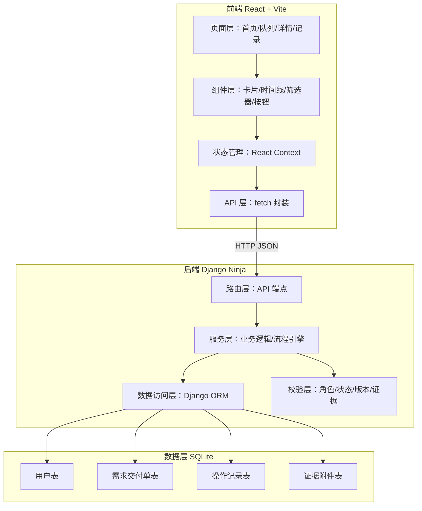
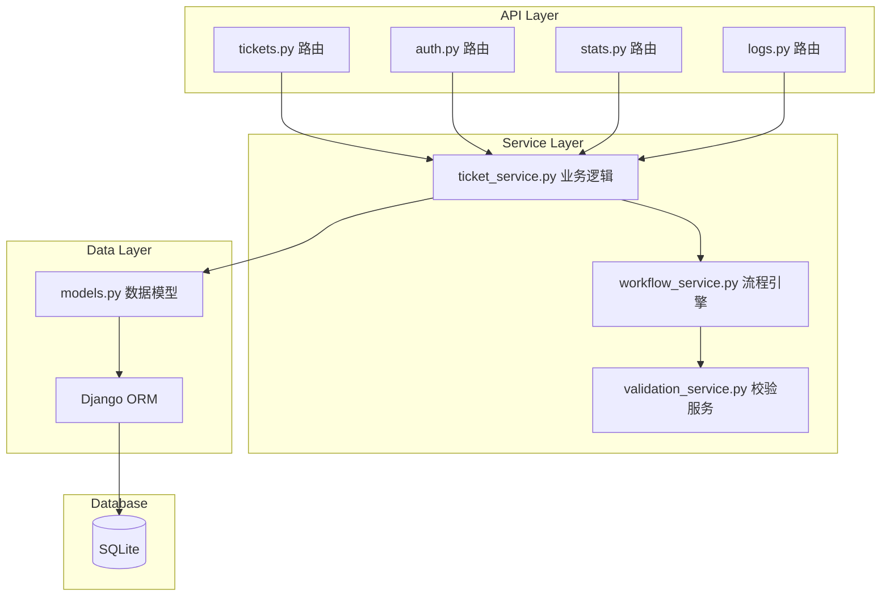
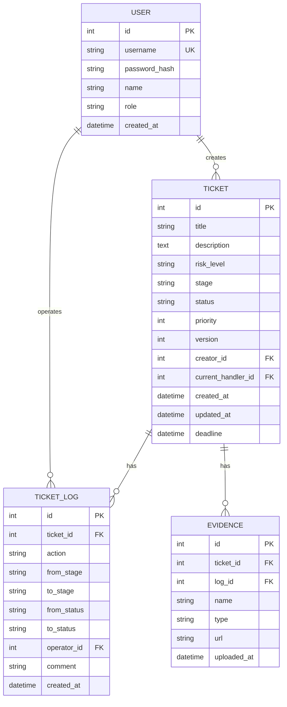

## 1. 架构设计



## 2. 技术描述

- **前端**：React 18 + React Router 6 + Vite 5
- **样式**：原生 CSS（CSS Variables 主题系统）
- **状态管理**：React Context + useReducer
- **后端**：Python 3.10 + Django 4.2 + Django Ninja 1.1
- **数据库**：SQLite（项目本地文件）
- **认证**：基于 Token 的简单认证（演示用）
- **端口**：前端 3007，后端 8007（均可配置）

## 3. 前端路由定义

| 路由 | 页面 | 说明 |
|------|------|------|
| / | 工作台首页 | 统计概览、快捷入口 |
| /tickets | 需求队列 | 需求交付单列表，支持筛选排序 |
| /tickets/:id | 需求详情 | 单条需求详情、处理历史、操作区 |
| /logs | 操作记录 | 全量操作日志列表 |
| /login | 登录页 | 角色切换登录 |

## 4. 后端 API 定义

### 4.1 认证接口

| 方法 | 路径 | 说明 |
|------|------|------|
| POST | /api/auth/login | 用户登录，返回 token |
| GET | /api/auth/me | 获取当前用户信息 |

### 4.2 需求交付单接口

| 方法 | 路径 | 说明 |
|------|------|------|
| GET | /api/tickets | 获取需求列表（支持筛选、分页、排序） |
| GET | /api/tickets/{id} | 获取单条需求详情 |
| POST | /api/tickets | 发起新需求交付单 |
| PUT | /api/tickets/{id}/action | 执行操作（推进/退回/补正/归档） |
| GET | /api/tickets/{id}/logs | 获取操作历史 |

### 4.3 统计接口

| 方法 | 路径 | 说明 |
|------|------|------|
| GET | /api/stats/dashboard | 工作台统计数据 |
| GET | /api/stats/overview | 整体统计概览 |

### 4.4 操作记录接口

| 方法 | 路径 | 说明 |
|------|------|------|
| GET | /api/logs | 获取操作记录列表 |

### 4.5 数据 Schema（TypeScript）

```typescript
interface User {
  id: number;
  username: string;
  name: string;
  role: 'registrar' | 'auditor' | 'reviewer';
  avatar?: string;
}

interface Ticket {
  id: number;
  title: string;
  description: string;
  risk_level: 'high' | 'medium' | 'low';
  stage: 'confirm' | 'schedule' | 'acceptance';
  status: 'pending' | 'processing' | 'returned' | 'completed' | 'overdue';
  priority: number;
  version: number;
  current_handler_id: number | null;
  creator_id: number;
  created_at: string;
  updated_at: string;
  deadline: string;
  evidences: Evidence[];
}

interface TicketLog {
  id: number;
  ticket_id: number;
  action: string;
  action_label: string;
  operator_id: number;
  operator_name: string;
  from_stage: string;
  to_stage: string;
  from_status: string;
  to_status: string;
  comment: string;
  created_at: string;
  evidences: Evidence[];
}

interface Evidence {
  id: number;
  name: string;
  type: string;
  url: string;
  uploaded_at: string;
}

interface DashboardStats {
  total_pending: number;
  stage_counts: Record<string, number>;
  risk_counts: Record<string, number>;
  overdue_count: number;
  my_todo_count: number;
}
```

## 5. 服务端架构图



## 6. 数据模型

### 6.1 ER 图



### 6.2 模型说明

**User（用户表）**
- role 字段：registrar（登记员）、auditor（审核主管）、reviewer（复核负责人）

**Ticket（需求交付单表）**
- risk_level：high/medium/low，影响 priority 计算
- stage：confirm/schedule/acceptance 三阶段
- status：pending/processing/returned/completed/overdue
- version：乐观锁，每次操作 +1，防止并发冲突
- priority：优先级，高风险 100，中风险 50，低风险 10；逾期额外 +50

**TicketLog（操作记录表）**
- 记录每次状态变更的完整信息
- 包含 from/to 状态和阶段，支持完整回溯

**Evidence（证据附件表）**
- 关联到具体的操作记录
- 不同风险等级要求不同数量的证据
