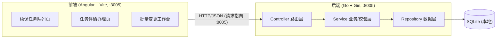
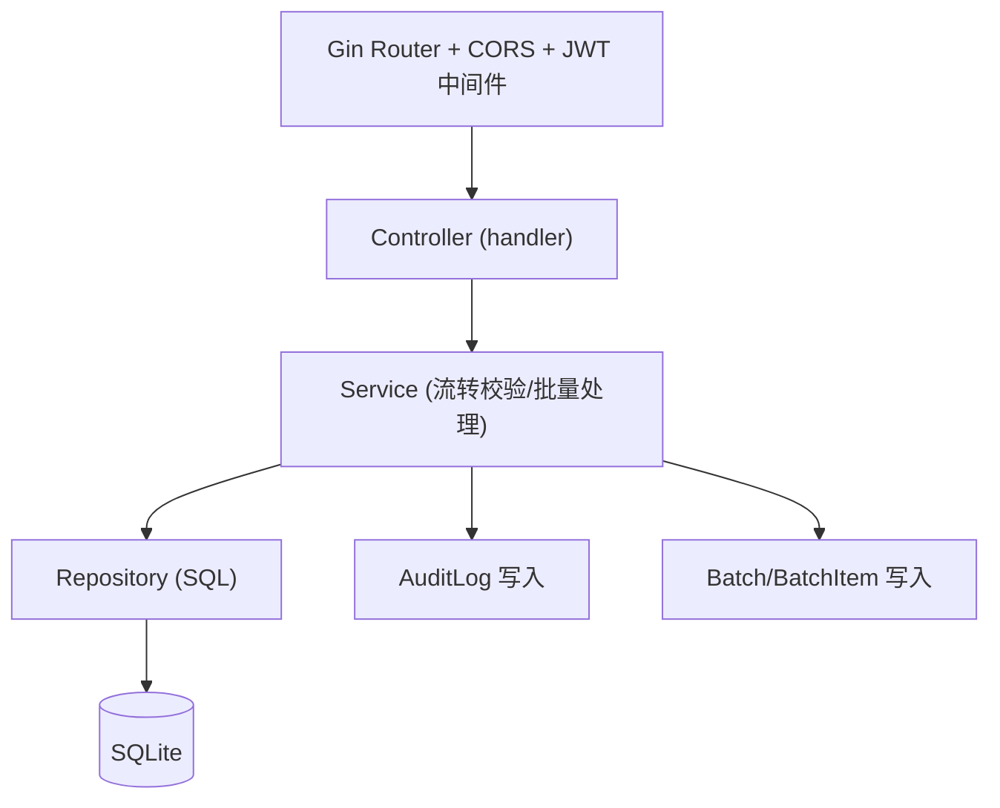
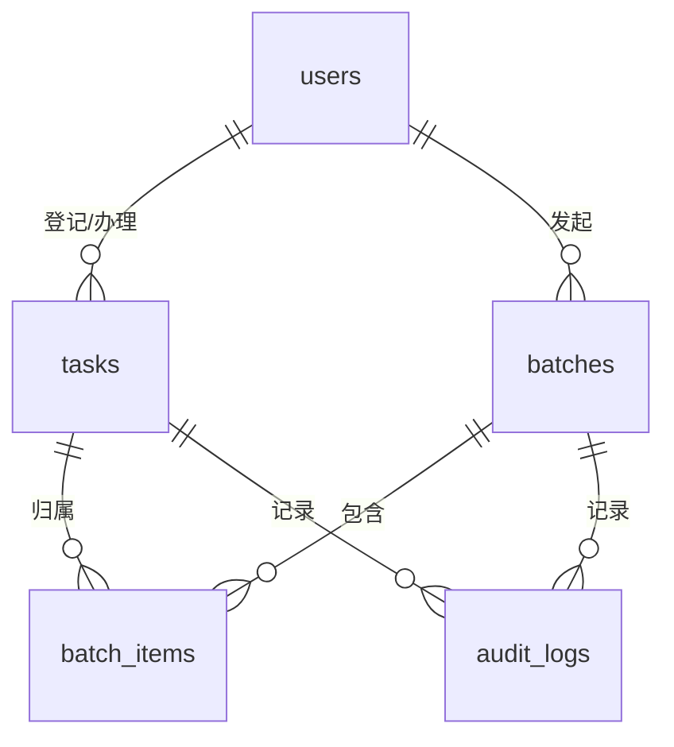

# 续保任务批量变更复核系统 — 技术架构文档

## 1. 架构设计



- 前端端口 3005，后端端口 8005；前端请求地址指向后端 8005
- 后端 CORS 放行前端端口 `http://localhost:3005`
- 数据落本地 SQLite 文件 `backend/data/renewal.db`

## 2. 技术选型

- 前端：Angular 18（独立组件）+ Vite 开发服务器（`@angular/build`，基于 Vite/esbuild）+ TypeScript，端口 3005
- 后端：Go + Gin + SQLite（`modernc.org/sqlite`，纯 Go 驱动，无需 CGO），端口 8005
- 鉴权：登录返回 JWT token，后续请求携带 `Authorization: Bearer <token>`
- CORS：Gin 中间件放行 `http://localhost:3005`

## 3. 路由定义（前端）

| 路由 | 用途 |
|-------|---------|
| `/` | 续保任务队列页（首屏，主队列 + 关键证据侧栏） |
| `/tasks/:id` | 任务详情办理页 |
| `/batches` | 批次列表 |
| `/batches/:id` | 批次明细 + 失败重试 + 批量审计 |

## 4. API 定义

### 4.1 鉴权

- `POST /api/login` — `{username, password}` → `{token, user:{id,username,role,displayName}}`
- `GET /api/me` — 返回当前用户

### 4.2 任务

- `GET /api/tasks?status=&role=&batchId=&q=&page=&size=` — 任务列表（筛选）
- `GET /api/tasks/:id` — 任务详情（含三段证据 + 流转历史）
- `POST /api/tasks` — 创建任务（客户经理）
- `PUT /api/tasks/:id` — 更新草稿/补证据（客户经理）
- `POST /api/tasks/:id/transition` — 单任务流转 `{action, evidence, version}`

`action` ∈ `submit | review | confirm | archive | reject`

### 4.3 批量变更

- `POST /api/batches` — `{taskIds[], action, evidence}` → 创建批次并逐项处理，返回批次与明细
- `GET /api/batches` — 批次列表
- `GET /api/batches/:id` — 批次明细（含每项成功/失败与原因）
- `POST /api/batches/:id/retry` — 对失败项重试 `{itemIds[]}` → 返回重试结果

### 4.4 审计

- `GET /api/audit?batchId=&taskId=` — 审计日志

### 4.5 统一错误结构

```ts
interface ApiError {
  code: 'FORBIDDEN_ROLE' | 'STALE_VERSION' | 'MISSING_EVIDENCE' | 'INVALID_STATUS' | 'UNAUTHORIZED' | 'BAD_REQUEST';
  message: string; // 具体原因，如 "当前角色无权执行此操作，需要【核保专员】"
  field?: string;
}
```

## 5. 服务端架构图



## 6. 数据模型

### 6.1 ER 图



### 6.2 DDL

```sql
CREATE TABLE IF NOT EXISTS users (
  id INTEGER PRIMARY KEY AUTOINCREMENT,
  username TEXT UNIQUE NOT NULL,
  password_hash TEXT NOT NULL,
  role TEXT NOT NULL CHECK(role IN ('customer_manager','underwriting_specialist','business_owner')),
  display_name TEXT NOT NULL,
  created_at DATETIME DEFAULT CURRENT_TIMESTAMP
);

CREATE TABLE IF NOT EXISTS tasks (
  id INTEGER PRIMARY KEY AUTOINCREMENT,
  task_no TEXT UNIQUE NOT NULL,
  policy_no TEXT NOT NULL,
  customer_name TEXT NOT NULL,
  product TEXT NOT NULL,
  renewal_type TEXT NOT NULL,
  original_premium REAL NOT NULL,
  new_premium REAL NOT NULL,
  status TEXT NOT NULL DEFAULT 'draft',
  version INTEGER NOT NULL DEFAULT 1,
  submitter_id INTEGER REFERENCES users(id),
  current_handler_role TEXT,
  reg_evidence TEXT,
  verify_evidence TEXT,
  archive_evidence TEXT,
  last_batch_id INTEGER,
  created_at DATETIME DEFAULT CURRENT_TIMESTAMP,
  updated_at DATETIME DEFAULT CURRENT_TIMESTAMP
);

CREATE TABLE IF NOT EXISTS batches (
  id INTEGER PRIMARY KEY AUTOINCREMENT,
  batch_no TEXT UNIQUE NOT NULL,
  action TEXT NOT NULL,
  operator_id INTEGER REFERENCES users(id),
  operator_role TEXT NOT NULL,
  total INTEGER NOT NULL,
  success_count INTEGER NOT NULL DEFAULT 0,
  fail_count INTEGER NOT NULL DEFAULT 0,
  status TEXT NOT NULL DEFAULT 'completed',
  created_at DATETIME DEFAULT CURRENT_TIMESTAMP
);

CREATE TABLE IF NOT EXISTS batch_items (
  id INTEGER PRIMARY KEY AUTOINCREMENT,
  batch_id INTEGER REFERENCES batches(id) ON DELETE CASCADE,
  task_id INTEGER REFERENCES tasks(id),
  task_no TEXT,
  status TEXT NOT NULL,
  error_reason TEXT,
  retry_count INTEGER NOT NULL DEFAULT 0,
  processed_at DATETIME DEFAULT CURRENT_TIMESTAMP
);

CREATE TABLE IF NOT EXISTS audit_logs (
  id INTEGER PRIMARY KEY AUTOINCREMENT,
  batch_id INTEGER REFERENCES batches(id),
  task_id INTEGER REFERENCES tasks(id),
  task_no TEXT,
  action TEXT NOT NULL,
  operator_id INTEGER REFERENCES users(id),
  operator_role TEXT NOT NULL,
  from_status TEXT,
  to_status TEXT,
  detail TEXT,
  created_at DATETIME DEFAULT CURRENT_TIMESTAMP
);
```

## 7. 后端校验规则（绕过页面直提也要拦截）

针对每个流转动作（单任务或批量逐项）：

| 规则 | 触发条件 | 返回码 | 具体原因示例 |
|------|----------|--------|--------------|
| 错角色 | 当前用户角色 != 动作所需角色 | 403 FORBIDDEN_ROLE | "当前角色【客户经理】无权执行复核，需要【核保专员】" |
| 旧版本 | 请求 version != tasks.version | 409 STALE_VERSION | "任务版本已过期（本地v2，服务端v3），请刷新后重试" |
| 缺证据 | 对应动作所需证据为空 | 422 MISSING_EVIDENCE | "缺少【过程核验证据】" |
| 错状态 | tasks.status != 动作期望前置状态 | 409 INVALID_STATUS | "任务状态为【已确认】，无法再次复核" |

动作所需角色、前置状态、所需证据：

| 动作 | 所需角色 | 前置状态 | 所需证据 |
|------|----------|----------|----------|
| submit | customer_manager | draft | reg_evidence |
| review | underwriting_specialist | submitted | verify_evidence |
| confirm | business_owner | reviewed | archive_evidence |
| archive | business_owner | confirmed | （无新增，需已确认） |
| reject | 对应岗位 | submitted/reviewed | （可附原因） |

## 8. 种子样例（暴露问题）

预置样例任务用于暴露问题，覆盖角色切换、筛选、详情办理与批量操作联动：

- T1 草稿 + 登记证据齐备：可被客户经理提交（成功样例）
- T2 草稿 + 登记证据缺失：提交会触发 MISSING_EVIDENCE（缺证据）
- T3 已提交 + 旧版本标记：客户端用旧版本号提交会触发 STALE_VERSION（旧版本）
- T4 已提交：可被核保专员复核（成功样例）
- T5 已复核：可被业务负责人确认（成功样例）
- T6 已确认：若再复核/再确认会触发 INVALID_STATUS（错状态）
- T7 草稿 + 登记证据齐备：批量提交成功样例
- T8 已提交：批量复核成功样例

三个演示账号：
- 客户经理 `cm_demo / cm123`
- 核保专员 `us_demo / us123`
- 业务负责人 `bo_demo / bo123`
